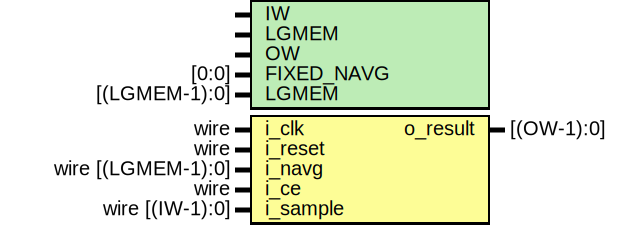

# Entity: boxcar 

- **File**: boxcar.v
## Diagram

## Generics

| Generic name | Type          | Value     | Description |
| ------------ | ------------- | --------- | ----------- |
| IW           |               | 16        |             |
| LGMEM        |               | 6         |             |
| OW           |               | undefined |             |
| FIXED_NAVG   | [0:0]         | 1'b0      |             |
| LGMEM        | [(LGMEM-1):0] | -1        |             |
## Ports

| Port name | Direction | Type                | Description |
| --------- | --------- | ------------------- | ----------- |
| i_clk     | input     | wire                |             |
| i_reset   | input     | wire                |             |
| i_navg    | input     | wire  [(LGMEM-1):0] |             |
| i_ce      | input     | wire                |             |
| i_sample  | input     | wire  [(IW-1):0]    |             |
| o_result  | output    | [(OW-1):0]          |             |
## Signals

| Name             | Type                  | Description |
| ---------------- | --------------------- | ----------- |
| full             | reg                   |             |
| rdaddr           | reg  [(LGMEM-1):0]    |             |
| wraddr           | reg  [(LGMEM-1):0]    |             |
| mem              | reg  [(IW-1):0]       |             |
| preval           | reg  [(IW-1):0]       |             |
| memval           | reg  [(IW-1):0]       |             |
| sub              | reg  [IW:0]           |             |
| acc              | reg  [(IW+LGMEM-1):0] |             |
| w_requested_navg | wire [(LGMEM-1):0]    |             |
| rounded          | wire [(IW+LGMEM-1):0] |             |
| f_past_valid     | reg                   |             |
| f_rdaddr         | wire [LGMEM-1:0]      |             |
| f_sum            | reg  [LGMEM+IW-1:0]   |             |
| f_full_addr      | wire [LGMEM-1:0]      |             |
| f_test           | reg  [3:0]            |             |
| f_navg           | reg  [(LGMEM-1):0]    |             |
| k                | integer               |             |
## Constants

| Name       | Type  | Value | Description |
| ---------- | ----- | ----- | ----------- |
| OPT_SIGNED | [0:0] | 1'b0  |             |
## Processes
- unnamed: ( @(posedge i_clk) )
  - **Type:** always
- unnamed: ( @(posedge i_clk) )
  - **Type:** always
- unnamed: ( @(posedge i_clk) )
  - **Type:** always
- unnamed: ( @(posedge i_clk) )
  - **Type:** always
- unnamed: ( @(posedge i_clk) )
  - **Type:** always
- unnamed: ( @(posedge i_clk) )
  - **Type:** always
- unnamed: ( @(posedge i_clk) )
  - **Type:** always
- unnamed: ( @(posedge i_clk) )
  - **Type:** always
- unnamed: ( @(posedge i_clk) )
  - **Type:** always
- unnamed: ( @(posedge i_clk) )
  - **Type:** always
- unnamed: ( @(*) )
  - **Type:** always
- unnamed: ( @(posedge i_clk) )
  - **Type:** always
- unnamed: ( @(*) )
  - **Type:** always
- unnamed: ( @(posedge i_clk) )
  - **Type:** always
- unnamed: ( @(*) )
  - **Type:** always
- unnamed: ( @(posedge i_clk) )
  - **Type:** always
- unnamed: ( @(posedge i_clk) )
  - **Type:** always
- unnamed: ( @(posedge i_clk) )
  - **Type:** always
- unnamed: ( @(*) )
  - **Type:** always
- unnamed: ( @(*) )
  - **Type:** always
- unnamed: ( @(posedge i_clk) )
  - **Type:** always
- unnamed: ( @(posedge i_clk) )
  - **Type:** always
