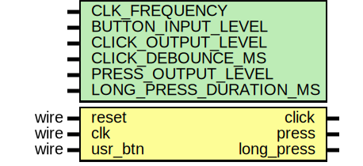

# Entity: btn_debouncer 

- **File**: btn_debouncer.sv
## Diagram

## Generics

| Generic name            | Type | Value     | Description |
| ----------------------- | ---- | --------- | ----------- |
| CLK_FREQUENCY           |      | 100000000 |             |
| BUTTON_INPUT_LEVEL      |      | 1         |             |
| CLICK_OUTPUT_LEVEL      |      | 1         |             |
| CLICK_DEBOUNCE_MS       |      | 10        |             |
| LONG_PRESS_OUTPUT_LEVEL |      | 1         |             |
| LONG_PRESS_DURATION_MS  |      | 1000      |             |
## Ports

| Port name  | Direction | Type | Description |
| ---------- | --------- | ---- | ----------- |
| reset      | input     | wire |             |
| clk        | input     | wire |             |
| usr_btn    | input     | wire |             |
| click      | output    |      |             |
| long_press | output    |      |             |
## Signals

| Name         | Type                  | Description |
| ------------ | --------------------- | ----------- |
| xor_path     | logic [1:0]           |             |
| boot_counter | logic [BOOT_CNT_WL:0] |             |
## Constants

| Name        | Type | Value                                                  | Description |
| ----------- | ---- | ------------------------------------------------------ | ----------- |
| SYS_CLKS    |      | $rtoi($ceil(CLK_FREQUENCY/1000*CLICK_DEBOUNCE_MS)      |             |
| BOOT_CLKS   |      | $rtoi($ceil(CLK_FREQUENCY/1000*LONG_PRESS_DURATION_MS) |             |
| BOOT_CNT_WL |      | $clog2(BOOT_CLKS)                                      |             |
## Processes
- unnamed: ( @( posedge clk ) )
  - **Type:** always_ff
