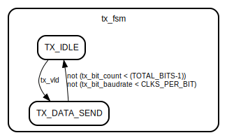
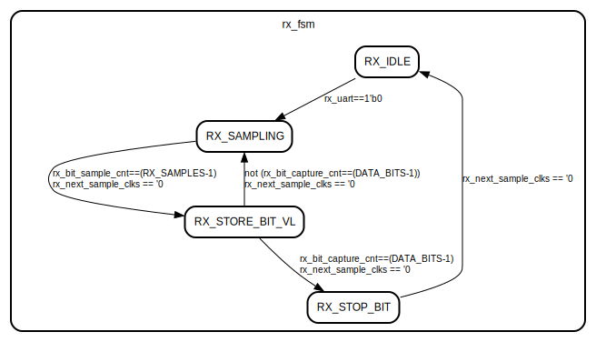

# Entity: uart_lite 

- **File**: uart_lite.sv
## Diagram

## Generics

| Generic name  | Type | Value    | Description |
| ------------- | ---- | -------- | ----------- |
| BAUD_RATE     |      | 115200   |             |
| CLK_FREQUENCY |      | 48000000 |             |
| DATA_BITS     |      | 8        |             |
| RX_SAMPLES    |      | 3        |             |
## Ports

| Port name | Direction | Type                  | Description |
| --------- | --------- | --------------------- | ----------- |
| clk       | input     | wire                  |             |
| reset     | input     | wire                  |             |
| tx_rdy    | output    |                       |             |
| tx_vld    | input     | wire                  |             |
| tx_data   | input     | wire  [DATA_BITS-1:0] |             |
| tx_uart   | output    |                       |             |
| rx_valid  | output    |                       |             |
| rx_data   | output    | [DATA_BITS-1:0]       |             |
| rx_uart   | input     | wire                  |             |
## Signals

| Name                     | Type                                                                                                                                                                                                      | Description |
| ------------------------ | --------------------------------------------------------------------------------------------------------------------------------------------------------------------------------------------------------- | ----------- |
| tx_bit_baudrate          | logic [CLKS_PER_BIT_WL-1:0]                                                                                                                                                                               |             |
| tx_bit_count             | logic   [TOTAL_BITS_WL-1:0]                                                                                                                                                                               |             |
| tx_data_buff             | logic    [TOTAL_BITS-1:0]                                                                                                                                                                                 |             |
| tx_fsm                   | enum { TX_IDLE,  TX_DATA_SEND}                                                                                                      |             |
| rx_bit_capture_cnt       | logic [DATA_BITS_WL-1:0]                                                                                                                                                                                  |             |
| rx_bit_sample_cnt        | logic [RX_SAMPLES_WL-1:0]                                                                                                                                                                                 |             |
| rx_bit_curr_sample_value | logic [RX_SAMPLES_WL:0]                                                                                                                                                                                   |             |
| rx_next_sample_clks      | logic [CLKS_PER_BIT_WL:0]                                                                                                                                                                                 |             |
| rx_fsm                   | enum { RX_IDLE,  RX_SAMPLING,  RX_STORE_BIT_VL,  RX_STOP_BIT} |             |
## Constants

| Name                | Type                        | Value                                  | Description |
| ------------------- | --------------------------- | -------------------------------------- | ----------- |
| rcalc_CLKS_PER_BIT  |                             | $rtoi($ceil(CLK_FREQUENCY/BAUD_RATE)   |             |
| CLKS_PER_BIT_WL     |                             | $clog2(rcalc_CLKS_PER_BIT)             |             |
| CLKS_PER_BIT        |                             | undefined                              |             |
| TOTAL_BITS          |                             | 1 + DATA_BITS + 1                      |             |
| TOTAL_BITS_WL       |                             | $clog2(TOTAL_BITS)                     |             |
| DATA_BITS_WL        |                             | $clog2(DATA_BITS)                      |             |
| RX_SAMPLES_WL       |                             | $clog2(RX_SAMPLES)                     |             |
| RX_SAMPLE_CLKS      | logic [CLKS_PER_BIT_WL-1:0] | CLKS_PER_BIT                           |             |
| RX_LAST_SAMPLE_CLKS | logic [CLKS_PER_BIT_WL-1:0] | CLKS_PER_BIT-RX_SAMPLES*RX_SAMPLE_CLKS |             |
## Processes
- tx_block: ( @(posedge clk) )
  - **Type:** always_ff
- rx_block: ( @(posedge clk) )
  - **Type:** always_ff
## State machines

