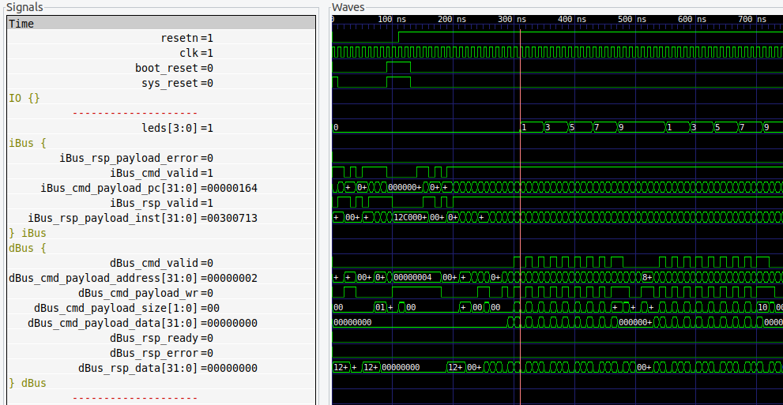

****

# 🚎 Arty-S7-Rover (experiments)

### Disclaimer

> ==**An experiment** with the Arty S7==, [7 Ways to Leave Your Spartan-6 FPGA](https://community.element14.com/technologies/fpga-group/w/documents/27537/7-ways-to-leave-your-spartan-6-fpga) [](https://community.element14.com/) challenge.

The Arty-S7-Rover is a small functional autonomous vehicle based on the [Digilent Arty S7-50 board](https://digilent.com/reference/programmable-logic/arty-s7/start). The project was done for the [7 Ways to Leave Your Spartan-6 FPGA](https://community.element14.com/technologies/fpga-group/w/documents/27537/7-ways-to-leave-your-spartan-6-fpga) [](https://community.element14.com/) challenge.

All the files are open-source, MIT license and can be downloaded from [-dramoz](https://github.com/dramoz/arty-s7)

### Experiments

A collection of some experiments I tried while building this project

## VexRiscv

### How fast can I toggle a led?

> - [x] ***RISC-V IO registers latency test***

Toggling a bit from a microprocessor would require some instructions that add some latency to the event. The firmware in this case is a simple toggle operation on an IO register.

```c++
#include "memory_map.h"
int main(void) {
  for(;;) {
    WRITE_IO(LEDS_REG, 5);
    WRITE_IO(LEDS_REG, ~5);
  };
  return 0;
}
```

<p align = "center">
  
</p>
<p align = "center">
<i>Arty-S7 VexRiscv LED toggle (1)</i>
</p>

By checking the simulation, I saw that there was a latency - caused by the `for(;;)` loop, which caused a jump and a reload of the target register address in the RISCV CPU registers.

```assembly
int main(void) {
  for(;;) {
    WRITE_IO(LEDS_REG, 5);
 14c:	800007b7          	lui	a5,0x80000
 150:	00500713          	li	a4,5
 154:	00e7a623          	sw	a4,12(a5) # 8000000c <__io_end+0xfffffc0c>
    WRITE_IO(LEDS_REG, ~5);
 158:	ffa00713          	li	a4,-6
 15c:	00e7a623          	sw	a4,12(a5)
  for(;;) {
 160:	fedff06f          	j	14c <main>
```

#### Another try

```c++
#include "memory_map.h"

int main(void) {
  for(;;) {
    WRITE_IO(LEDS_REG, 1);
    WRITE_IO(LEDS_REG, 2);
    WRITE_IO(LEDS_REG, 3);
    WRITE_IO(LEDS_REG, 4);
    WRITE_IO(LEDS_REG, 5);
    WRITE_IO(LEDS_REG, 6);
    WRITE_IO(LEDS_REG, 7);
    WRITE_IO(LEDS_REG, 8);
    WRITE_IO(LEDS_REG, 9);
    WRITE_IO(LEDS_REG, 0);
  };
  return 0;
}
```

<p align = "center">
  
</p>
<p align = "center">
<i>Arty-S7 VexRiscv LED toggle (2)</i>
</p>


Note that this case is misleading, as by checking the assembly file you can notice that the compiler did a good job and the target address is only loaded once.

```assembly
int main(void) {
  for(;;) {
    WRITE_IO(LEDS_REG, 1);
 14c:	800007b7          	lui	a5,0x80000
 150:	00100713          	li	a4,1
 154:	00e7a623          	sw	a4,12(a5) # 8000000c <__io_end+0xfffffc0c>
    WRITE_IO(LEDS_REG, 2);
 158:	00200713          	li	a4,2
 15c:	00e7a623          	sw	a4,12(a5)
    WRITE_IO(LEDS_REG, 3);
 160:	00300713          	li	a4,3
 164:	00e7a623          	sw	a4,12(a5)
    WRITE_IO(LEDS_REG, 4);
 168:	00400713          	li	a4,4
 16c:	00e7a623          	sw	a4,12(a5)
    WRITE_IO(LEDS_REG, 5);
 170:	00500713          	li	a4,5
 174:	00e7a623          	sw	a4,12(a5)
    WRITE_IO(LEDS_REG, 6);
 178:	00600713          	li	a4,6
 17c:	00e7a623          	sw	a4,12(a5)
    WRITE_IO(LEDS_REG, 7);
 180:	00700713          	li	a4,7
 184:	00e7a623          	sw	a4,12(a5)
    WRITE_IO(LEDS_REG, 8);
 188:	00800713          	li	a4,8
 18c:	00e7a623          	sw	a4,12(a5)
    WRITE_IO(LEDS_REG, 9);
 190:	00900713          	li	a4,9
 194:	00e7a623          	sw	a4,12(a5)
    WRITE_IO(LEDS_REG, 0);
 198:	0007a623          	sw	zero,12(a5)
  for(;;) {
 19c:	fb1ff06f          	j	14c <main>
```

#### A final attempt produced the expected behaviour.

```c++
#include "memory_map.h"
int main(void) {
  for(;;) {
    WRITE_IO(LEDS_REG, 1);
    WRITE_IO(DEBUG_REG, 2);
    WRITE_IO(LEDS_REG, 3);
    WRITE_IO(DEBUG_REG, 4);
    WRITE_IO(LEDS_REG, 5);
    WRITE_IO(DEBUG_REG, 6);
    WRITE_IO(LEDS_REG, 7);
    WRITE_IO(DEBUG_REG, 8);
    WRITE_IO(LEDS_REG, 9);
    WRITE_IO(DEBUG_REG, 0);
  };
  return 0;
}
```

<p align = "center">
  
</p>
<p align = "center">
<i>Arty-S7 VexRiscv LED toggle (3)</i>
</p>


> **👉 As seen on the waves, it takes four (4) clock cycles to set up an IO register.**

## Arty-S7

### The right PWM frequency

Finding the right Geared Motor DC PMW frequency and duty cycle was challenging. The geared dc motor added an extra complexity as the required starting torque was high. To speed up the test, firmware that used the dip switch and buttons to switch between different speeds and RTL with different PWM frequencies was created. After some trial and error, the best frequency found was 500Hz, with a duty cycle range between 30% and 100%. For the final version of the project, the max duty cycle was set to 80% as the difference in speed was not required.

```c++
///////////////////////////////////////////////////////////////////////////////
// File: main.cpp
// Copyright (c) 2022. Danilo Ramos
// All rights reserved.
// This license message must appear in all versions of this code including
// modified versions.
////////////////////////////////////////////////////////////////////////////////
// Overview
// Arty-S7-ROVER FW
////////////////////////////////////////////////////////////////////////////////

#include<cstdint>
#include "memory_map.h"

const uint32_t CLK_FREQ     = 100000000;
const uint32_t RGB_PWM_FREQ =     20000;
const uint32_t RGB_DCYLE  = uint32_t(0.01 * CLK_FREQ/RGB_PWM_FREQ);

const uint32_t MOTOR_PWM_FREQ   = 500;
const uint32_t MOTOR_FULL_STOP  = 0;
const uint32_t MOTOR_SLOW_SPEED = uint32_t(0.1 * CLK_FREQ/MOTOR_PWM_FREQ);
const uint32_t MOTOR_HIGH_SPEED = uint32_t(0.5 * CLK_FREQ/MOTOR_PWM_FREQ);
const uint32_t MOTOR_SPEED_STEP = uint32_t(0.4/16 * CLK_FREQ/MOTOR_PWM_FREQ);

const uint32_t UART_MASK    = 0x80000000;

int main(void) {
  // LEDs
  uint32_t leds_st = 1;
  uint32_t rgb0 = 1;
  uint32_t rgb1 = 1;
  
  // IOs
  uint32_t btn = 0;
  uint32_t sw  = 0;
  
  // Setup Motors PWMs
  uint32_t dir_rpt = (uint32_t)('s');  // s:stop, f:forward, b:backward, l:left, r:right
  uint32_t motor_curr_speed = MOTOR_FULL_STOP;
  WRITE_IO(M0_BWD_PWM_REG, MOTOR_FULL_STOP);
  WRITE_IO(M0_FWD_PWM_REG, MOTOR_FULL_STOP);
  WRITE_IO(M1_BWD_PWM_REG, MOTOR_FULL_STOP);
  WRITE_IO(M1_FWD_PWM_REG, MOTOR_FULL_STOP);
  
  // Setup RGBs to low intensity
  WRITE_IO(RGB0_DCYCLE_REG, RGB_DCYLE);
  WRITE_IO(RGB1_DCYCLE_REG, RGB_DCYLE);
  
  // Turn on LEDs 1 to ACK PWR and RISCV boot OK.
  WRITE_IO(LEDS_REG, leds_st);
  
  // UART Hello World
  const char* hello_msg = "Arty-S7 ROVER (VexRiscv)\r\n";
  uint32_t inx = 0;
  
  bool pending_tx;
  uint32_t uart_rx;
  uint32_t uart_tx;
  
  while(hello_msg[inx]!=0) {
    uart_tx = READ_IO(UART0_TX_REG);
    if((uart_tx & UART_MASK)==0) {
      WRITE_IO(UART0_TX_REG, (uint32_t)hello_msg[inx] | UART_MASK);
      ++inx;
    }
  };
  
  // Loop forever
  pending_tx = false;
  uart_rx = 0;
  for(;;) {
    btn = READ_IO(BUTTONS_REG);
    sw  = READ_IO(SWITCHES_REG);
    
    // DC motors
    // Select speed from SW
    if(sw==0) {
      motor_curr_speed = MOTOR_FULL_STOP;
    }
    else if(sw==0xff) {
      motor_curr_speed = MOTOR_HIGH_SPEED;
    }
    else {
      motor_curr_speed = MOTOR_SPEED_STEP * sw + MOTOR_SLOW_SPEED;
    }
    
    // Select direction from button
    // Prioritize as only one setting is possible
    leds_st = btn;
    if(btn & 0x1) {
      // Move FWD
      dir_rpt = (uint32_t)('f');
      WRITE_IO(M0_BWD_PWM_REG, MOTOR_FULL_STOP);
      WRITE_IO(M0_FWD_PWM_REG, motor_curr_speed);
      WRITE_IO(M1_BWD_PWM_REG, MOTOR_FULL_STOP);
      WRITE_IO(M1_FWD_PWM_REG, motor_curr_speed);
    }
    else if(btn & 0x2) {
      // Move BKD
      dir_rpt = (uint32_t)('b');
      WRITE_IO(M0_BWD_PWM_REG, motor_curr_speed);
      WRITE_IO(M0_FWD_PWM_REG, MOTOR_FULL_STOP);
      WRITE_IO(M1_BWD_PWM_REG, motor_curr_speed);
      WRITE_IO(M1_FWD_PWM_REG, MOTOR_FULL_STOP);
    }
    else if(btn & 0x4) {
      // Move Right
      dir_rpt = (uint32_t)('r');
      WRITE_IO(M0_BWD_PWM_REG, MOTOR_FULL_STOP);
      WRITE_IO(M0_FWD_PWM_REG, motor_curr_speed);
      WRITE_IO(M1_BWD_PWM_REG, motor_curr_speed);
      WRITE_IO(M1_FWD_PWM_REG, MOTOR_FULL_STOP);
    }
    else if(btn & 0x8) {
      // Move Left
      dir_rpt = (uint32_t)('l');
      WRITE_IO(M0_BWD_PWM_REG, motor_curr_speed);
      WRITE_IO(M0_FWD_PWM_REG, MOTOR_FULL_STOP);
      WRITE_IO(M1_BWD_PWM_REG, MOTOR_FULL_STOP);
      WRITE_IO(M1_FWD_PWM_REG, motor_curr_speed);
    }
    else {
      // Stop
      dir_rpt = 0;
      WRITE_IO(M0_BWD_PWM_REG, MOTOR_FULL_STOP);
      WRITE_IO(M0_FWD_PWM_REG, MOTOR_FULL_STOP);
      WRITE_IO(M1_BWD_PWM_REG, MOTOR_FULL_STOP);
      WRITE_IO(M1_FWD_PWM_REG, MOTOR_FULL_STOP);
    }
    
    // Update LEDs
    WRITE_IO(LEDS_REG, leds_st);
    WRITE_IO(RGB0_REG, rgb0);
    WRITE_IO(RGB1_REG, rgb1);
    
    // UART
    if(!pending_tx) {
      uart_rx = READ_IO(UART0_RX_REG);
    }
    
    // Echo
    if(uart_rx & UART_MASK) {
      uart_tx = READ_IO(UART0_TX_REG);
      if((uart_tx & UART_MASK)==0) {
        WRITE_IO(UART0_TX_REG, uart_rx);
        pending_tx = false;
        uart_rx = 0;
      }
      else {
        pending_tx = true;
      }
    }
    else {
      // Report
      if(!pending_tx) {
        if(dir_rpt) {
          WRITE_IO(UART0_TX_REG, dir_rpt | UART_MASK);
          dir_rpt = 0;
        }
      }
    }
  };
  
  return 0;
}
```

[LINK youtube to DEMO]

