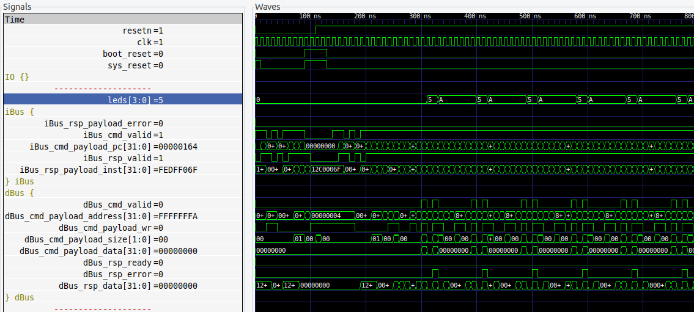
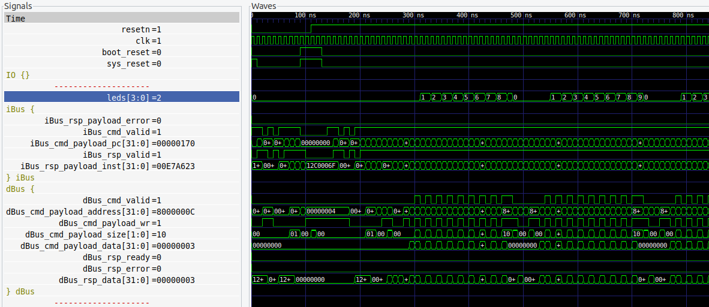

****

# 🚎 Arty-S7-Rover (experiments)

### Disclaimer

> ==**Build a project** with the Arty S7==, [7 Ways to Leave Your Spartan-6 FPGA](https://community.element14.com/technologies/fpga-group/w/documents/27537/7-ways-to-leave-your-spartan-6-fpga) [](https://community.element14.com/) challenge.

The Arty-S7-Rover is a small functional autonomous vehicle based on the [Digilent Arty S7-50 board](https://digilent.com/reference/programmable-logic/arty-s7/start). The project was done for the [7 Ways to Leave Your Spartan-6 FPGA](https://community.element14.com/technologies/fpga-group/w/documents/27537/7-ways-to-leave-your-spartan-6-fpga) [](https://community.element14.com/) challenge.

All the files are open-source, MIT license and can be downloaded from [-dramoz](https://github.com/dramoz/arty-s7)

### Experiments

A collection of some experiments I tried while building this project

## VexRiscv

### How fast can I toggle a led?

> - [x] ***RISC-V IO registers latency test***

Toggling a bit from a microprocessor would require some instructions that add some latency to the event. The firmware in this case is a simple toggle operation on an IO register.

```c++
#include "memory_map.h"
int main(void) {
  for(;;) {
    WRITE_IO(LEDS_REG, 5);
    WRITE_IO(LEDS_REG, ~5);
  };
  return 0;
}
```

<p align = "center">
  
</p>
<p align = "center">
<i>Arty-S7 VexRiscv LED toggle (1)</i>
</p>

By checking the simulation, I saw that there was a latency - caused by the `for(;;)` loop, which caused a jump and a reload of the target register address in the RISCV CPU registers.

```assembly
int main(void) {
  for(;;) {
    WRITE_IO(LEDS_REG, 5);
 14c:	800007b7          	lui	a5,0x80000
 150:	00500713          	li	a4,5
 154:	00e7a623          	sw	a4,12(a5) # 8000000c <__io_end+0xfffffc0c>
    WRITE_IO(LEDS_REG, ~5);
 158:	ffa00713          	li	a4,-6
 15c:	00e7a623          	sw	a4,12(a5)
  for(;;) {
 160:	fedff06f          	j	14c <main>
```

Another try:

```c++
#include "memory_map.h"

int main(void) {
  for(;;) {
    WRITE_IO(LEDS_REG, 1);
    WRITE_IO(LEDS_REG, 2);
    WRITE_IO(LEDS_REG, 3);
    WRITE_IO(LEDS_REG, 4);
    WRITE_IO(LEDS_REG, 5);
    WRITE_IO(LEDS_REG, 6);
    WRITE_IO(LEDS_REG, 7);
    WRITE_IO(LEDS_REG, 8);
    WRITE_IO(LEDS_REG, 9);
    WRITE_IO(LEDS_REG, 0);
  };
  return 0;
}
```

<p align = "center">
  
</p>
<p align = "center">
<i>Arty-S7 VexRiscv LED toggle (2)</i>
</p>

Note that this case is misleading, as by checking the assembly file you can notice that the compiler did a good job and the target address is only loaded once.

```assembly
int main(void) {
  for(;;) {
    WRITE_IO(LEDS_REG, 1);
 14c:	800007b7          	lui	a5,0x80000
 150:	00100713          	li	a4,1
 154:	00e7a623          	sw	a4,12(a5) # 8000000c <__io_end+0xfffffc0c>
    WRITE_IO(LEDS_REG, 2);
 158:	00200713          	li	a4,2
 15c:	00e7a623          	sw	a4,12(a5)
    WRITE_IO(LEDS_REG, 3);
 160:	00300713          	li	a4,3
 164:	00e7a623          	sw	a4,12(a5)
    WRITE_IO(LEDS_REG, 4);
 168:	00400713          	li	a4,4
 16c:	00e7a623          	sw	a4,12(a5)
    WRITE_IO(LEDS_REG, 5);
 170:	00500713          	li	a4,5
 174:	00e7a623          	sw	a4,12(a5)
    WRITE_IO(LEDS_REG, 6);
 178:	00600713          	li	a4,6
 17c:	00e7a623          	sw	a4,12(a5)
    WRITE_IO(LEDS_REG, 7);
 180:	00700713          	li	a4,7
 184:	00e7a623          	sw	a4,12(a5)
    WRITE_IO(LEDS_REG, 8);
 188:	00800713          	li	a4,8
 18c:	00e7a623          	sw	a4,12(a5)
    WRITE_IO(LEDS_REG, 9);
 190:	00900713          	li	a4,9
 194:	00e7a623          	sw	a4,12(a5)
    WRITE_IO(LEDS_REG, 0);
 198:	0007a623          	sw	zero,12(a5)
  for(;;) {
 19c:	fb1ff06f          	j	14c <main>
```

A final attempt produced the expected behaviour.

```c++
#include "memory_map.h"
int main(void) {
  for(;;) {
    WRITE_IO(LEDS_REG, 1);
    WRITE_IO(DEBUG_REG, 2);
    WRITE_IO(LEDS_REG, 3);
    WRITE_IO(DEBUG_REG, 4);
    WRITE_IO(LEDS_REG, 5);
    WRITE_IO(DEBUG_REG, 6);
    WRITE_IO(LEDS_REG, 7);
    WRITE_IO(DEBUG_REG, 8);
    WRITE_IO(LEDS_REG, 9);
    WRITE_IO(DEBUG_REG, 0);
  };
  return 0;
}
```

<p align = "center">
  
</p>
<p align = "center">
<i>Arty-S7 VexRiscv LED toggle (2)</i>
</p>


> **👉 As seen on the waves, it takes four (4) clock cycles to set up an IO register.**

## Arty-S7

### The right PWM frequency

Finding the right Geared Motor DC PMW frequency and duty cycle


### Reading multiple sensors
