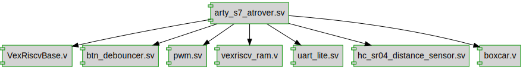
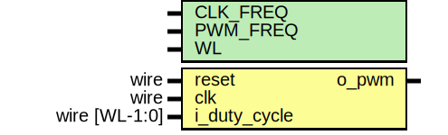

****

# 🚎 Arty-S7-Rover (base architecture)

### Disclaimer

> ==**Build a project** with the Arty S7==, [7 Ways to Leave Your Spartan-6 FPGA](https://community.element14.com/technologies/fpga-group/w/documents/27537/7-ways-to-leave-your-spartan-6-fpga) [](https://community.element14.com/) challenge.

The Arty-S7-Rover is a small functional autonomous vehicle based on the [Digilent Arty S7-50 board](https://digilent.com/reference/programmable-logic/arty-s7/start). The project was done for the [7 Ways to Leave Your Spartan-6 FPGA](https://community.element14.com/technologies/fpga-group/w/documents/27537/7-ways-to-leave-your-spartan-6-fpga) [](https://community.element14.com/) challenge.

All the files are open-source, MIT license and can be downloaded from [-dramoz/arty-s7](https://github.com/dramoz/arty-s7)

### Base Architecture

This second blog[^firstblog] of four goes through the initial requirements (e.g. tools, build process) and the basic HDL for the 🚎 Arty-S7-Rover project.

[^firstblog]: The first blog was [Xilinx Spartan-7 vs Spartan-6](https://community.element14.com/technologies/fpga-group/b/blog/posts/xilinx-spartan-7-vs-spartan-6).

The base architecture implements the RISC-V core, the required memory banks and IO registers, a UART IP for serial port communications, a PWM  block, and a simple firmware to test the setup by controlling the LEDs with user input from the buttons and dipswitch. All the RTL was implemented in SystemVerilog. Note that this project does not use Vivado IP Integrator, and all the HDL is FPGA vendor independent[^ramgen].

[^ramgen]: The VexRiscv RAM was generated with the aid of Vivado Language Templates, but the end result is a common RTL implementation.

## Repository

The [-dramoz/arty-s7](https://github.com/dramoz/arty-s7) contains all the code (RTL, C++, STL) and documentation files for this project. It also has other Arty-S7 examples not described in these blogs, but feel free to explore or ask any questions.

### Getting the files

```bash
# Clone repository
mkdir -p ~/dev; cd ~/dev
git clone https://github.com/dramoz/arty-s7.git
#git clone git@github.com:dramoz/arty-s7.git (if SSH access enabled)

# Get submodule(s)
cd arty-s7
git submodule update --init --recursive

# RTL files
cd projects/arty_s7_atrover

# Firmware files
cd projects/arty_s7_atrover/vexriscv_generator/VexRiscvBase/
```

### Directory structure

---

<pre><font color="#3465A4"><b>https://github.com/dramoz/arty-s7</b></font>
├── <font color="#3465A4"><b>3Dmodels</b></font>
├── <font color="#4E9A06"><b>arty-s7.code-workspace</b></font>
├── <font color="#3465A4"><b>assets</b></font>
├── <font color="#3465A4"><b>board</b></font>
├── <font color="#3465A4"><b>docs</b></font>
├── <font color="#4E9A06"><b>LICENSE</b></font>
├── <font color="#3465A4"><b>projects</b></font>
<span style="background-color: #FFFF00">│   ├── <font color="#3465A4"><b>arty_s7_atrover</b></font></span>
│   │   ├── <font color="#3465A4"><b>assets</b></font>
│   │   ├── <font color="#3465A4"><b>constrs</b></font>
│   │   ├── <font color="#3465A4"><b>docs</b></font>
│   │   ├── <font color="#4E9A06"><b>README.md</b></font>
│   │   ├── <font color="#3465A4"><b>rtl</b></font>
│   │   ├── <font color="#4E9A06"><b>spartan7_blog_experiments.md</b></font>
│   │   ├── <font color="#4E9A06"><b>spartan7_blog_project.md</b></font>
│   │   ├── <font color="#4E9A06"><b>spartan7_blog_sensor_actuator.md</b></font>
│   │   ├── <font color="#4E9A06"><b>spartan7_blog_summary.md</b></font>
│   │   ├── <font color="#3465A4"><b>src</b></font>
│   │   ├── <font color="#3465A4"><b>tb</b></font>
│   │   ├── <font color="#3465A4"><b>tcl</b></font>
│   │   ├── <font color="#4E9A06"><b>typescript</b></font>
│   │   └── <span style="background-color: #FFFF00"><font color="#3465A4"><b>vexriscv_generator</b></font></span>
│   └── <font color="#3465A4"><b>arty_s7_test</b></font>
└── <font color="#4E9A06"><b>README.md</b></font>
</pre>
<p align = "center">
🗁<i>Arty-S7 repository structure</i>
</p>

---

➜ The `vexriscv_generator` submodule has the required setup to build up the FW and generate the custom VexRiscv for this project. The VexRiscv architecture used in this project is the `VexRiscvBase`. The `VexRiscv` is a submodule pointing the the VexRiscv GitHub project.

---

<pre><font color="#3465A4"><b>arty-s7/projects/arty_s7_atrover/vexriscv_generator</b></font>
├── <font color="#3465A4"><b>cpu_template</b></font>
├── <font color="#4E9A06"><b>gen_vexriscv.sh</b></font>
├── <font color="#4E9A06"><b>jtag.py</b></font>
├── <font color="#4E9A06"><b>LICENSE</b></font>
├── <font color="#3465A4"><b>minVexRiscv</b></font>
├── <font color="#3465A4"><b>minVexRiscvJtag</b></font>
├── <font color="#4E9A06"><b>minVexRiscv.ld</b></font>
├── <font color="#4E9A06"><b>README.md</b></font>
├── <font color="#3465A4"><b>scripts</b></font>
├── <font color="#3465A4"><b>spinalhdl_example</b></font>
├── <span style="background-color: #FFFF00"><font color="#3465A4"><b>VexRiscv</b></font></span>
<span style="background-color: #FFFF00">├── <font color="#3465A4"><b>VexRiscvBase</b></font></span>
│   ├── <font color="#3465A4"><b>build</b></font>
│   ├── <font color="#4E9A06"><b>build_fw.sh</b></font>
│   ├── <font color="#4E9A06"><b>commands.sh</b></font>
│   ├── <font color="#4E9A06"><b>cpu_layout.yaml</b></font>
│   ├── <font color="#4E9A06"><b>gcc_riscv_args.md</b></font>
│   ├── <font color="#4E9A06"><b>linker_sections.ld</b></font>
│   ├── <font color="#4E9A06"><b>Makefile</b></font>
│   ├── <font color="#3465A4"><b>rtl</b></font>
│   ├── <font color="#3465A4"><b>spinalhdl</b></font>
│   ├── <font color="#3465A4"><b>src</b></font>
│   ├── <font color="#4E9A06"><b>typescript</b></font>
│   └── <font color="#4E9A06"><b>vexriscv_init.cfg</b></font>
└── <font color="#3465A4"><b>VexRiscvJtagAxi4</b></font>
</pre>
<p align = "center">
🗁<i>Arty-S7-Rover VexRiscv (FW) repository structure</i>
</p>
---

## Description

The Arty-S7-Rover is a semi-autonomous vehicle that uses a [Xilinx Spartan-7/50 FPGA](https://www.xilinx.com/products/silicon-devices/fpga/spartan-7.html) as its main processor. Inside the FPGA a [RISC-V](https://en.wikipedia.org/wiki/RISC-V) microprocessor was instantiated plus other RTL blocks to control the vehicle. Without too many details, the Arty-S7-Rover is built from three main blocks:

- Hardware
  - Arty S7-50 development board
    - RISC-V 32bits processor core + instruction/data memory
    - IPs for IO control
  - 3D printed chassis
    - The required STL files are under the `arty-s7/3Dmodels/` and not under the project subfolder.
  - Sensors & Actuators
    - 2xDC motors
    - Ultrasound range finder
    - 10 DOF sensor
- HDL
  - Verilog/SystemVerilog RTL
  - VexRiscv/SpinalHDL RISC-V microprocessor
- Firmware
  - RISC-V C/C++ code

The RISC-V microprocessor was selected as a challenge. Commonly, projects that required an embedded processor for a Xilinx Spartan device may use the Xilinx [MicroBlaze Soft Processor Core](https://www.xilinx.com/products/design-tools/microblaze.html), so I was curious about using a different softcore and testing the design flow with this project.

<p align = "center">
  
</p>
<p align = "center">
<i>Arty S7 Rover</i>
</p>

## Tools (+Setup)

All the development of the project was done in a [VirtualBox](https://www.virtualbox.org/) VM running [ Ubuntu 20.04.4 LTS (Focal Fossa)](https://releases.ubuntu.com/20.04.4/),  on a  host computer with  Windows11/Pro.

> 📝 It should be possible to run the tools natively on a Ubuntu20.04 installation or on WSL2. A Linux distribution is required for RISC-V

### Xilinx - Vivado

Download and install [Vivado ML Edition 2022.1](https://www.xilinx.com/support/download/index.html/content/xilinx/en/downloadNav/vivado-design-tools/2022-1.html). The free edition is Spartan-7 friendly and does not require any license.

> 👉 The drivers to program the Arty-S7 can be installed directly on the VM and use USB passthrough as shown in the picture below. However, in my particular setup, I installed Xilinx Lab Server on the host machine and connected the Vivado running from the VM.

<p align = "center">
  
</p>
<p align = "center">
<i>Ubuntu-VM USB passthrough</i>
</p>
<p align = "center">
  
</p>
<p align = "center">
<i>Vivado Remote Target</i>
</p>

### SpinalHDL / VexRiscv

The [](https://riscv.org/) used in this project ([VexRiscv](https://github.com/SpinalHDL/VexRiscv)) was generated using [SpinalHDL](https://spinalhdl.github.io/SpinalDoc-RTD/master/index.html), a [Scala](https://www.scala-lang.org/)-based HDL library. 

> 👉 Learning Scala or SpinalHDL is not required to build this project or to build a RISC-V. The Verilog files are included in the repository. Furthermore,  the VexRiscv GitHub project comes with plenty of examples that should cover most needs and can be generated with a few steps. Creating a VexRiscv is as simple as installing the tool and running the required script/model.
>
> 📝 The generated output is a single Verilog (.v) file with all required modules inside.

```bash
# Install Scala
mkdir -p ~/tools; cd ~/tools
curl -fL https://github.com/coursier/launchers/raw/master/cs-x86_64-pc-linux.gz | gzip -d > cs && chmod +x cs && ./cs setup

# Generate a VexRiscv
cd ~/repos
git clone git@github.com:SpinalHDL/VexRiscv.git
cd ~/repos/VexRiscv/
sbt "runMain vexriscv.demo.GenFull"
```

> ➜ The VexRiscv used in this project is already generated and saved in the repository in the RTL directory.

The [dramoz/arty-s7](https://github.com/dramoz/arty-s7) repository submodules the [dramoz/vexriscv_generator](https://github.com/dramoz/vexriscv_generator) repository, where the required files to generate the core processor and the firmware can be found.

### RISC-V Toolchain (C/C++)

To compile the FW, download and install the prebuilt [](https://www.sifive.com/) [toolchain](https://www.sifive.com/software):

```bash
# Download toolchain
mkdir -p ~/tools; cd ~/tools
wget https://static.dev.sifive.com/dev-tools/freedom-tools/v2020.12/riscv64-unknown-elf-toolchain-10.2.0-2020.12.8-x86_64-linux-ubuntu14.tar.gz

# Extract and move to the installation directory
tar -xzvf riscv64-unknown-elf-toolchain-10.2.0-2020.12.8-x86_64-linux-ubuntu14.tar.gz
sudo mv riscv64-unknown-elf-toolchain-10.2.0-2020.12.8-x86_64-linux-ubuntu14 /opt/riscv64-unknown-elf-toolchain

# Update bash to add toolchain path
echo 'export PATH=/opt/riscv64-unknown-elf-toolchain/bin:$PATH' >> ~/.bashrc
source ~/.bashrc

# Test
riscv64-unknown-elf-gcc --version
> riscv64-unknown-elf-gcc (SiFive GCC-Metal 10.2.0-2020.12.8) 10.2.0
> Copyright (C) 2020 Free Software Foundation, Inc.
> This is free software; see the source for copying conditions.  There is NO
> warranty; not even for MERCHANTABILITY or FITNESS FOR A PARTICULAR PURPOSE.
```

#### Generating Verilog memory HEX file

To generate a compatible Verilog HEX file with the RISC-V firmware, it is necessary to convert it with [ elf2hex](https://github.com/sifive/elf2hex) application.

```bash
# Clone repository elf2hex
mkdir -p ~/repos; cd ~/repos
git clone git://github.com/sifive/elf2hex.git

# Install elf2hex
cd elf2hex
autoreconf -i
./configure --target=riscv64-unknown-elf
make -j $(nproc)
sudo make install
```

### Verification Tools

[](https://veripool.org/guide/latest/index.html) [](https://docs.cocotb.org/en/stable/) 

All the verification for this project was done using Open Source projects:

- [**Verilator**](https://github.com/verilator/verilator) is the fastest Verilog/SystemVerilog simulator.
- [**cocotb**](https://github.com/cocotb/cocotb) is a *COroutine* based *COsimulation* *TestBench* environment for verifying VHDL and SystemVerilog [RTL](https://docs.cocotb.org/en/stable/glossary.html#term-RTL) using [Python](https://www.python.org/).
- [GTKwave](http://gtkwave.sourceforge.net/) is a fully featured [GTK+](http://www.gtk.org/) based wave viewer for Unix, Win32, and Mac OSX which reads LXT, LXT2, VZT, FST, and GHW files as well as standard Verilog VCD/EVCD files and allows their viewing.

### Other tools

Other tools used in this project

- [ Visual Studio Code](https://code.visualstudio.com/) SystemVerilog and C/C++ editor
  - [ TerosHDL](https://marketplace.visualstudio.com/items?itemName=teros-technology.teroshdl) plugin (for documentation generation)
-  [ VirtualBox](https://www.virtualbox.org/) for Ubuntu20 on Windows11Pro
-  [ GNU Make](https://www.gnu.org/software/make/) for firmware/code elaboration and HW simulation.
-   [TeraTerm](https://ttssh2.osdn.jp/index.html.en) or any other serial terminal.

## The project

### Top Level

The top-level block connects to:

- Inputs
  - DIP switches (4)
  - Buttons (4)
  - UART Rx
  - Distance Sensor Echo Pulse
- Outputs
  - LEDs (2)
  - RGB LEDs (2) - each one requires three inputs (red, green, blue)
  - DC Motors PWM output (4)
  - UART Tx
  - Distance Sensor Trigger

<p align = "center">
  
</p>
<p align = "center">
<i>Arty-S7-Rover top IO diagram</i>
</p>


<p align = "center">
  
</p>
<p align = "center">
<i>Arty-S7-Rover top dependency diagram</i>
</p>


### VexRiscv

The VexRiscv is a plugin-based HDL RISC-V core. For this project, a simple architecture was selected:

- RV32IM
  - 32-bit architecture
  - Integer ALU plus multiplication and division
  - 5-stage in-order pipeline
- Simple instruction/data memory access (e.g. no cached)

> 👉The custom Scala code is just to split the generated Verilog RTL in a wrapper and an implemented design, as I prefer to have a top wrapper to hide the one-file has it all VexRiscv style.

<p align = "center">
  
</p>
<p align = "center">
<i>Arty-S7 VexRiscv core IO diagram</i>
</p>

### Core RAM

<p align = "center">
  
</p>
<p align = "center">
<i>Arty-S7 VexRiscv RAM IO diagram</i>
</p>

As the generated processor core does not have any memory instantiation, the instruction/data memory is created as a true dual-port RAM using Vivado Language Templates. The RAM is implemented with the following parameters, as required by the VexRiscv architecture:

- True dual port, Write first w/ Byte-write
- 8192 Bytes
  - 4096 instruction memory
  - 4096 data memory
- Low latency (e.g. not registered outputs): VexRiscv requires that memory access has only one clock latency.

Selecting the template:

- ` Project Manager ˃ Language Templates  `
  -  `Verilog ˃ Synthesis Constructs ˃ Coding Examples ˃ RAM ˃ BlockRAM ˃ True Dual Port`
    - `True Dual Port ˃ 1 Clock  ˃ Write First Mode w/ Byte-write` 

<p align = "center">
  
</p>
<p align = "center">
<i>Vivado Language Templates</i>
</p>

> ⚠ Instruction and data memory share the same memory block, where instruction access is read-only while data access is read/write (which would be useful if JTAG debug is implemented)

### IO Peripherals

IO peripherals are handled by an `IO Registers bank`.

| #    | Register        | Remarks                                                      | Bits                                                         |
| ---- | --------------- | ------------------------------------------------------------ | ------------------------------------------------------------ |
| 0    | DEBUG_REG       | General purpose register for debugging (not connected to any IO port) | [31:0]                                                       |
| 1    | UART0_TX_REG    | UART0 transmission register                                  | [31]: Set to one to initiate the transmission, clear to zero when by HW indicating UART ready for next byte<br />[7:0]: Byte to be transmitted |
| 2    | UART0_RX_REG    | UART0 reception register                                     | [31]: Poll bit indicating new byte available, clear to zero by HW after a read<br />[7:0]: Byte to be transmitted |
| 3    | LEDS_REG        | LEDs                                                         | [3:0] ↦LD[5:2]                                               |
| 4    | RGB0_REG        | RGB0 LEDs                                                    | [2:0] ↦ blue, green, red                                     |
| 5    | RGB0_DCYCLE_REG | RGB PWM duty cycle [0, 20000]                                | RGBs are handled by a 20KHz PWM                              |
| 6    | RGB1_REG        | RGB0 LEDs                                                    | [2:0] ↦ blue, green, red                                     |
| 7    | RGB1_DCYCLE_REG | RGB PWM duty cycle [0, 20000]                                | RGBs are handled by a 20KHz PWM                              |
| 8    | BUTTONS_REG     | Push buttons                                                 | [3:0]  ↦ BTN[3:0]                                            |
| 9    | SWITCHES_REG    | DIP switch                                                   | [3:0]  ↦ SW[3:0]                                             |
| 10   | M0_BWD_PWM_REG  | Motor 0 (left) backward PWM duty cycle                       | PWM frequency is set to 500 Hz                               |
| 11   | M0_FWD_PWM_REG  | Motor 0 (left) forward PWM duty cycle                        | PWM frequency is set to 500 Hz                               |
| 12   | M1_BWD_PWM_REG  | Motor 1 (right) backward PWM duty cycle                      | PWM frequency is set to 500 Hz                               |
| 13   | M1_FWD_PWM_REG  | Motor 1 (right) forward PWM duty cycle                       | PWM frequency is set to 500 Hz                               |
| 14   | DISTANCE_REG    | Ultrasound latest read. The RTL does a read every 1ms.       | [31]: Set to one on a new read, clear by HW on FW read operation<br />[30:0] Latest read value |

From the FW, the IO registers are accessed with:

```c++
// ----------------------------------------------------
// Registers declarations are handled in the file include/memory_map.h
// ----------------------------------------------------
// Example register declaration
uint32_t constexpr GPIO_BASE_ADDR = 0x80000000u;
uint32_t* const DEBUG_REG         = (uint32_t*)(0 * 0x04 + GPIO_BASE_ADDR);

// Macros declaration
#define READ_IO(REG_ID) (*REG_ID)
#define WRITE_IO(REG_ID, VL) (*REG_ID) = VL

// RD/WR access
WRITE_IO(DEBUG_REG, u32_var);
uint32_t var = READ_IO(DEBUG_REG);
```

> 📝 IO peripherals can be added/removed as required, that's the beauty of FPGAs and soft processors.

### Other blocks

#### PWM

The [Pulse Width Modulation (PWM)](https://en.wikipedia.org/wiki/Pulse-width_modulation) block is a fixed/hard frequency variable duty-cycle RTL block.

<p align = "center">
  
</p>
<p align = "center">
<i>PWM IO diagram</i>
</p>

#### UART

The Universal Asynchronous Receiver-Transmitter (UART) is a simple/lite RTL block with a fixed/hard baud rate.

<p align = "center">
  
</p>
<p align = "center">
<i>UART IO diagram</i>
</p>

#### Button debouncer

To avoid [metastability](https://alchitry.com/metastability-and-debouncing-verilog) on a button press an RTL block is connected between each FPGA button input and the RISC-V core. The debouncer block is a parametrizable block that generates a pulse (tick) after *N* ms of stable input, and also can detect user long button press. For the RISC-V reset, the debouncer is set to one second, so a long press is required to reset the processor. This is done to filter unwanted button presses.

<p align = "center">
  
</p>
<p align = "center">
<i>Button Debouncer IO diagram</i>
</p>

## Simulation

The simulation of the project is handled by make.

Speeding up the simulation

- Firmware: 
- RTL:

> 👉[](assets/waves/arty_s7_base.fst)

## Implementation

### Resource utilization

The full implementation of the base architecture used:

| Block           | LUTs (32600) | Registers (65200) | Block RAM (75) | DSPs (120) |
| --------------- | ------------ | ----------------- | -------------- | ---------- |
| arty_s7_atrover | 1824 (5.60%) | 1749 (2.68%)      | 9 (12.00%)     | 4 (3.33%)  |
| VexRiscv-RAM    | -            | -                 | 8 (10.67%)     | -          |
| VexRiscv        | 1720 (5.28%) | 1056 (1.62%)      | 1 (1.33%)      | 4 (3.33%)  |

A full utilization report can be found in [Base Architecture Utilization Report](assets/base_arch_utilization.txt)

<p align = "center">
  
  
  
    
</p>
<p align = "center">
<i>Base Architecture Implementation Reports & Floorplan (Vivado)</i>
</p>
