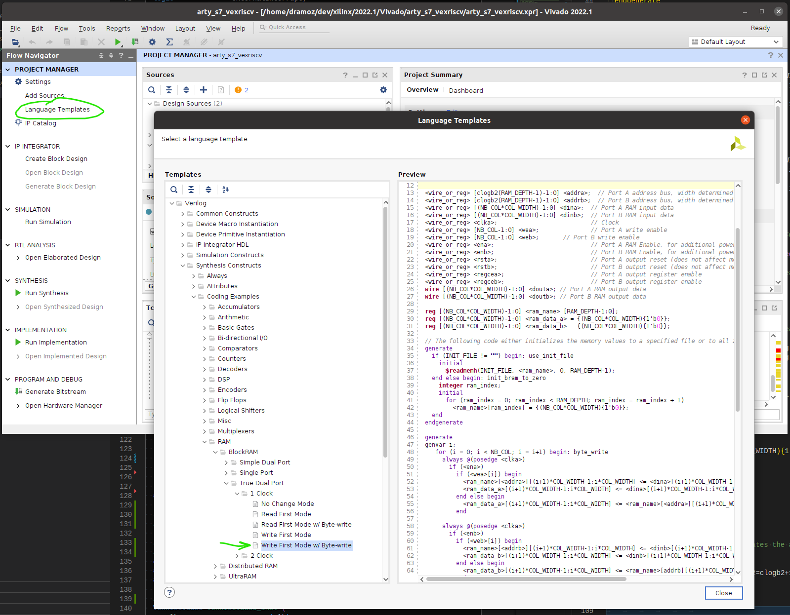
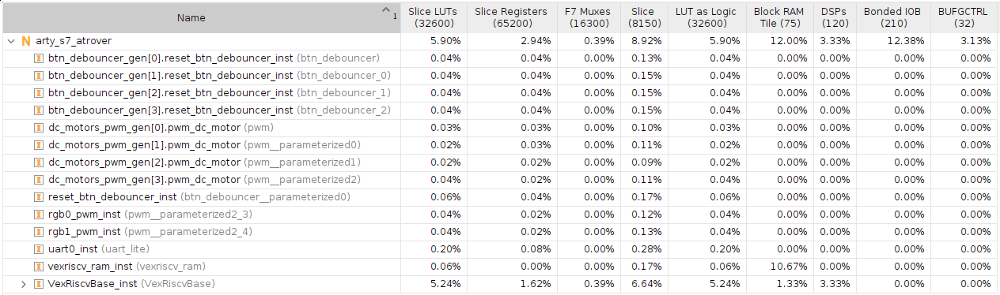

****

# 🚎 Arty-S7-Rover (base architecture)

### Disclaimer

> ==**Build a project** with the Arty S7==, [7 Ways to Leave Your Spartan-6 FPGA](https://community.element14.com/technologies/fpga-group/w/documents/27537/7-ways-to-leave-your-spartan-6-fpga) [](https://community.element14.com/) challenge.

The Arty-S7-Rover is a small functional autonomous vehicle based on the [Digilent Arty S7-50 board](https://digilent.com/reference/programmable-logic/arty-s7/start). The project was done for the [7 Ways to Leave Your Spartan-6 FPGA](https://community.element14.com/technologies/fpga-group/w/documents/27537/7-ways-to-leave-your-spartan-6-fpga) [](https://community.element14.com/) challenge.

All the files are open-source, MIT license and can be downloaded from [-dramoz](https://github.com/dramoz/arty-s7)

### Base Architecture

This first blog of three goes through the initial requirements (e.g. tools, build process) of the Arty-S7-Rover project.

The base architecture implements the RISC-V core, the required memory banks, a UART IP for serial port communications, PWM IP blocks, and a simple firmware to test the setup by controlling the LEDs with user input from the buttons and dipswitch.

## Description

The Arty-S7-Rover is a self-autonomous vehicle that uses a [Xilinx Spartan-7 FPGA](https://www.xilinx.com/products/silicon-devices/fpga/spartan-7.html) as its main processor. Inside the FPGA a [RISC-V](https://en.wikipedia.org/wiki/RISC-V) microprocessor was instantiated plus other IP blocks to control the vehicle. Without too many details, the Arty-S7-Rover consists of three different main blocks:

- Hardware
  - Arty S7-50 development board
    - RISC-V 32bits processor core + instruction/data memory
    - IPs for IO control
  - 3D printed chassis
  - Sensors & Actuators
    - 2xDC motors
    - Ultrasound range finder
    - 10 DOF sensor
- HDL
  - Verilog/SystemVerilog RTL
  - VexRiscv/SpinalHDL RISC-V microprocessor
- Firmware
  - RISC-V C/C++ code

The RISC-V microprocessor was selected as a challenge. Commonly, projects that required an embedded processor in the case of the Spartan-7 use the Xilinx [MicroBlaze Soft Processor Core](https://www.xilinx.com/products/design-tools/microblaze.html), so I was curious about using a different R&D flow for this project.

## Tools (+Setup)

All the development of the project was done in a [VirtualBox](https://www.virtualbox.org/) VM running [ Ubuntu 20.04.4 LTS (Focal Fossa)](https://releases.ubuntu.com/20.04.4/),  on a  host computer with  Windows11/Pro.

> 📝 It should be possible to run the tools natively on a Ubuntu20.04 installation or on WSL2. A Linux distribution is required for RISC-V

### Xilinx - Vivado

Download and install [Vivado ML Edition 2022.1](https://www.xilinx.com/support/download/index.html/content/xilinx/en/downloadNav/vivado-design-tools/2022-1.html). The free edition is Spartan-7 friendly and does not require any license.

> 📝 the drivers to program the Arty-S7 can be installed directly on the VM and use USB passthrough as shown in the picture below. However, in my particular setup, I installed Xilinx Lab Server on the host machine and connected from the Vivado running in the VM.


### SpinalHDL / VexRISCV (optional)

The [](https://riscv.org/) used in this project ([VexRiscv](https://github.com/SpinalHDL/VexRiscv)) was generated using [SpinalHDL](https://spinalhdl.github.io/SpinalDoc-RTD/master/index.html), a [Scala](https://www.scala-lang.org/)-based HDL library. 

> ⚠ Learning Scala or SpinalHDL is not required to build this project or to build a RISC-V as the VexRiscv GitHub project comes with plenty of examples that should cover most needs.

Creating a VexRiscv is as simple as installing the tool and running the script:

```bash
# Scala
mkdir -p ~/tools; cd ~/tools
curl -fL https://github.com/coursier/launchers/raw/master/cs-x86_64-pc-linux.gz | gzip -d > cs && chmod +x cs && ./cs setup

# VexRiscv Generator
cd ~/repos
git clone git@github.com:SpinalHDL/VexRiscv.git
cd ~/repos/VexRiscv/
sbt "runMain vexriscv.demo.GenFull"
```

👉The generated output is a Verilog (.v) file.

> 📝The VexRiscv used in this project is already generated and saved in the repository.

The [dramoz/arty-s7](https://github.com/dramoz/arty-s7) repository submodules the [dramoz/vexriscv_generator](https://github.com/dramoz/vexriscv_generator) repository, where the required files to generate the core processor and the firmware are located.

### RISC-V Toolchain (C/C++)

To compile the FW, download and install the prebuilt [](https://www.sifive.com/) [toolchain](https://www.sifive.com/software):

```bash
# Download toolchain
mkdir -p ~/tools; cd ~/tools
wget https://static.dev.sifive.com/dev-tools/freedom-tools/v2020.12/riscv64-unknown-elf-toolchain-10.2.0-2020.12.8-x86_64-linux-ubuntu14.tar.gz

# Extract and move to installation directory
tar -xzvf riscv64-unknown-elf-toolchain-10.2.0-2020.12.8-x86_64-linux-ubuntu14.tar.gz
sudo mv riscv64-unknown-elf-toolchain-10.2.0-2020.12.8-x86_64-linux-ubuntu14 /opt/riscv64-unknown-elf-toolchain

# Update bash to add toolchain path
echo 'export PATH=/opt/riscv64-unknown-elf-toolchain/bin:$PATH' >> ~/.bashrc
source ~/.bashrc

# Test
riscv64-unknown-elf-gcc --version
> riscv64-unknown-elf-gcc (SiFive GCC-Metal 10.2.0-2020.12.8) 10.2.0
> Copyright (C) 2020 Free Software Foundation, Inc.
> This is free software; see the source for copying conditions.  There is NO
> warranty; not even for MERCHANTABILITY or FITNESS FOR A PARTICULAR PURPOSE.
```

#### Generating HEX file

To generate a HEX file with the RISC-V program, it is necessary to convert it with [`elf2hex`].

```bash
git clone git://github.com/sifive/elf2hex.git
cd elf2hex
autoreconf -i
./configure --target=riscv64-unknown-elf
make
make install
```

### Verification Tools

[](https://veripool.org/guide/latest/index.html) [](https://docs.cocotb.org/en/stable/) 

- [**Verilator**](https://github.com/verilator/verilator) is the fastest Verilog/SystemVerilog simulator.
- [**cocotb**](https://github.com/cocotb/cocotb) is a *COroutine* based *COsimulation* *TestBench* environment for verifying VHDL and SystemVerilog [RTL](https://docs.cocotb.org/en/stable/glossary.html#term-RTL) using [Python](https://www.python.org/).
- [GTKwave](http://gtkwave.sourceforge.net/) is a fully featured [GTK+](http://www.gtk.org/) based wave viewer for Unix, Win32, and Mac OSX which reads LXT, LXT2, VZT, FST, and GHW files as well as standard Verilog VCD/EVCD files and allows their viewing.

### Other tools

Other tools used in this project

- [ Visual Studio Code](https://code.visualstudio.com/) SystemVerilog and C/C++ editor
  - [ TerosHDL](https://marketplace.visualstudio.com/items?itemName=teros-technology.teroshdl) plugin (for documentation generation)
-  [ VirtualBox](https://www.virtualbox.org/) for Ubuntu20 on Windows11Pro
-  [ GNU Make](https://www.gnu.org/software/make/) for firmware/code elaboration and HW simulation.
-   [TeraTerm](https://ttssh2.osdn.jp/index.html.en) or any other serial terminal.

## The project

### VexRiscv

The VexRiscv is a plugin-based HDL RISC-V core. For this project, a simple architecture was selected:

- RV32IM
  - 32-bit architecture
  - Integer ALU plus multiplication and division
  - 5-stage in-order pipeline
- Simple instruction/data memory access (e.g. no cached)

> 👉The custom Scala code is just to split the generated Verilog RTL in a wrapper and an implemented design, as I prefer to have a top wrapper to hide the one-file has it all VexRiscv style.

#### Block Diagram

The generated RIRSC-V core has the following IO ports:

<p align = "center">
  
</p>
<p align = "center">
<i>Arty-S7 VexRiscv core block diagram</i>
</p>

### Core RAM

As the generated processor core does not have any memory instantiation, the instruction/data memory is created as a true dual-port RAM using Vivado. The RAM is implemented with the following parameters, as required by the VexRiscv architecture:

- True dual port, read first w/ Byte-write
- 8192 Bytes
  - 4096 instruction memory
  - 4096 data memory
- Low latency (e.g. not registered outputs): VexRiscv requires that memory access has only one clock latency.

Selecting the template:

- ` Project Manager ˃ Language Templates  `
  -  `Verilog ˃ Synthesis Constructs ˃ Coding Examples ˃ RAM ˃ BlockRAM ˃ True Dual Port`
    - `True Dual Port ˃ 1 Clock  ˃ Write First Mode w/ Byte-write` 

<p align = "center">
  
</p>
<p align = "center">
<i>Vivado Language Templates</i>
</p>

> ⚠ Instruction and data memory share the same memory block, where instruction access is read-only while data access is read/write (which would be useful if JTAG debug is implemented)

### IO Peripherals

IO peripherals are handled by an `IO Registers bank`.

| #    | Register        | Remarks                                                      | Bits                                                         |
| ---- | --------------- | ------------------------------------------------------------ | ------------------------------------------------------------ |
| 0    | DEBUG_REG       | General purpose register for debugging (not connected to any IO port) | [31:0]                                                       |
| 1    | UART0_TX_REG    | UART0 transmission register                                  | [31]: Set to one to initiate the transmission, clear to zero when by HW indicating UART ready for next byte<br />[7:0]: Byte to be transmitted |
| 2    | UART0_RX_REG    | UART0 reception register                                     | [31]: Poll bit indicating new byte available, clear to zero by HW after a read<br />[7:0]: Byte to be transmitted |
| 3    | LEDS_REG        | LEDs                                                         | [3:0] ↦LD[5:2]                                               |
| 4    | RGB0_REG        | RGB0 LEDs                                                    | [2:0] ↦ blue, green, red                                     |
| 5    | RGB0_DCYCLE_REG | RGB PWM duty cycle [0, 20000]                                | RGBs are handled by a 20KHz PWM                              |
| 6    | RGB1_REG        | RGB0 LEDs                                                    | [2:0] ↦ blue, green, red                                     |
| 7    | RGB1_DCYCLE_REG | RGB PWM duty cycle [0, 20000]                                | RGBs are handled by a 20KHz PWM                              |
| 8    | BUTTONS_REG     | Push buttons                                                 | [3:0]  ↦ BTN[3:0]                                            |
| 9    | SWITCHES_REG    | DIP switch                                                   | [3:0]  ↦ SW[3:0]                                             |

From the FW, the IO registers are accessed with:

```c++
// ----------------------------------------------------
// Registers declarations are handled in the file include/memory_map.h
// ----------------------------------------------------
// Example register declaration
uint32_t constexpr GPIO_BASE_ADDR = 0x80000000u;
uint32_t* const DEBUG_REG         = (uint32_t*)(0 * 0x04 + GPIO_BASE_ADDR);

// Macros declaration
#define READ_IO(REG_ID) (*REG_ID)
#define WRITE_IO(REG_ID, VL) (*REG_ID) = VL

// RD/WR access
WRITE_IO(DEBUG_REG, u32_var);
uint32_t var = READ_IO(DEBUG_REG);
```

> 📝 IO peripherals can be added/removed as required, that's the beauty of FPGAs and Soft processors.

### Other blocks

- PWM: a simple PWM RTL block was implemented
- UART: a simple UART RTL block was implemented


## Simulation

The simulation of the project is handled by make.

- Firmware: 
- RTL:

> 👉[](assets/waves/arty_s7_base.fst)

## Implementation

### Resource utilization

The full implementation of the base architecture used:

| Block           | LUTs (32600) | Registers (65200) | Block RAM (75) | DSPs (120) |
| --------------- | ------------ | ----------------- | -------------- | ---------- |
| arty_s7_atrover | 1824 (5.60%) | 1749 (2.68%)      | 9 (12.00%)     | 4 (3.33%)  |
| VexRiscv-RAM    | -            | -                 | 8 (10.67%)     | -          |
| VexRiscv        | 1720 (5.28%) | 1056 (1.62%)      | 1 (1.33%)      | 4 (3.33%)  |

A full utilization report can be found in [Base Architecture Utilization Report](assets/base_arch_utilization.txt)

<p align = "center">
  
  
  
</p>
<p align = "center">
<i>Base Architecture Implementation Report (Vivado)</i>
</p>
