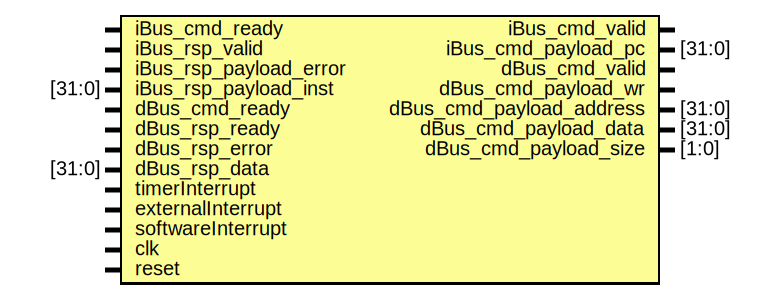

#  Arty-S7/50 - ArTy-ROVER

> ==**Build a project** with the Arty S7==, [7 Ways to Leave Your Spartan-6 FPGA](https://community.element14.com/technologies/fpga-group/w/documents/27537/7-ways-to-leave-your-spartan-6-fpga) [](https://community.element14.com/) challenge.

The ArTy-ROVER is a small functional autonomous vehicle based on the [Digilent Arty S7-50 board](https://digilent.com/reference/programmable-logic/arty-s7/start). The project was done for the [7 Ways to Leave Your Spartan-6 FPGA](https://community.element14.com/technologies/fpga-group/w/documents/27537/7-ways-to-leave-your-spartan-6-fpga) [](https://community.element14.com/) challenge.

All the files are open-source, MIT license and can be downloaded from [-dramoz](https://github.com/dramoz/arty-s7)

## Description

The ArTy-ROVER is a self-autonomous vehicle that uses a [Xilinx Spartan-7 FPGA](https://www.xilinx.com/products/silicon-devices/fpga/spartan-7.html) as its main processor. Inside the FPGA a [RISC-V](https://en.wikipedia.org/wiki/RISC-V) microprocessor was instantiated plus other IP blocks to control the vehicle. Without too many details, the ArTy-ROVER consists of three different main blocks:

- Hardware
  - Arty S7-50 development board
  - 3D printed chassis
  - Sensors & Actuators
    - 2xDC motors
    - Ultrasound range finder
    - 10 DOF sensor
- HDL
  - Verilog/SystemVerilog RTL
  - VexRiscv/SpinalHDL RISC-V microprocessor
- Firmware
  - RISC-V C/C++ code

The RISC-V microprocessor was selected as a challenge. Commonly, projects that required an embedded processor in the case of the Spartan-7 use the Xilinx [MicroBlaze Soft Processor Core](https://www.xilinx.com/products/design-tools/microblaze.html), so I was curious about using a different R&D flow for this project.

## Tools (+Setup)

All the development of the project was done in a [VirtualBox](https://www.virtualbox.org/) VM running [ Ubuntu 20.04.4 LTS (Focal Fossa)](https://releases.ubuntu.com/20.04.4/),  on a  host computer with  Windows11/Pro.

> 📝 It should be possible to run the tools natively on a Ubuntu20.04 installation or on WSL2. A Linux distribution is required for RISC-V

### Xilinx - Vivado

Download and install [Vivado ML Edition 2022.1](https://www.xilinx.com/support/download/index.html/content/xilinx/en/downloadNav/vivado-design-tools/2022-1.html). The free edition is Spartan-7 friendly and does not require any license.

> 📝 the drivers to program the Arty-S7 can be installed directly on the VM and use USB passthrough as shown in the picture below. However, in my particular setup, I installed Xilinx Lab Server on the host machine and connected from the Vivado running in the VM.


### SpinalHDL / VexRISCV (optional)

The [](https://riscv.org/) used in this project ([VexRiscv](https://github.com/SpinalHDL/VexRiscv)) was generated using [SpinalHDL](https://spinalhdl.github.io/SpinalDoc-RTD/master/index.html), a [Scala](https://www.scala-lang.org/)-based HDL library. 

> ⚠ Learning Scala or SpinalHDL is not required to build this project or to build a RISC-V as the VexRiscv GitHub project comes with plenty of examples that should cover most needs.

Creating a VexRiscv is as simple as installing the tool and running the script:

```bash
# Scala
mkdir -p ~/tools; cd ~/tools
curl -fL https://github.com/coursier/launchers/raw/master/cs-x86_64-pc-linux.gz | gzip -d > cs && chmod +x cs && ./cs setup

# VexRiscv Generator
cd ~/repos
git clone git@github.com:SpinalHDL/VexRiscv.git
cd ~/repos/VexRiscv/
sbt "runMain vexriscv.demo.GenFull"
```

👉The generated output is a Verilog (.v) file.

> 📝The VexRiscv used in this project is already generated and saved in the repository.

The [dramoz/arty-s7](https://github.com/dramoz/arty-s7) repository submodules the [dramoz/vexriscv_generator](https://github.com/dramoz/vexriscv_generator) repository, where the required files to generate the core processor and the firmware are located.

### RISC-V Toolchain (C/C++)

To compile the FW, download and install the prebuilt [](https://www.sifive.com/) [toolchain](https://www.sifive.com/software):

```bash
# Download toolchain
mkdir -p ~/tools; cd ~/tools
wget https://static.dev.sifive.com/dev-tools/freedom-tools/v2020.12/riscv64-unknown-elf-toolchain-10.2.0-2020.12.8-x86_64-linux-ubuntu14.tar.gz

# Extract and move to installation directory
tar -xzvf riscv64-unknown-elf-toolchain-10.2.0-2020.12.8-x86_64-linux-ubuntu14.tar.gz
sudo mv riscv64-unknown-elf-toolchain-10.2.0-2020.12.8-x86_64-linux-ubuntu14 /opt/riscv64-unknown-elf-toolchain

# Update bash to add toolchain path
echo 'export PATH=/opt/riscv64-unknown-elf-toolchain/bin:$PATH' >> ~/.bashrc
source ~/.bashrc

# Test
riscv64-unknown-elf-gcc --version
> riscv64-unknown-elf-gcc (SiFive GCC-Metal 10.2.0-2020.12.8) 10.2.0
> Copyright (C) 2020 Free Software Foundation, Inc.
> This is free software; see the source for copying conditions.  There is NO
> warranty; not even for MERCHANTABILITY or FITNESS FOR A PARTICULAR PURPOSE.
```

### Other tools

Other tools used in this project

- [ Visual Studio Code](https://code.visualstudio.com/)
  - [ TerosHDL](https://marketplace.visualstudio.com/items?itemName=teros-technology.teroshdl) plugin (for documentation generation)
-  [ VirtualBox](https://www.virtualbox.org/)

## Creating the project

### VexRiscv

The VexRiscv is a plugin-based HDL RISC-V core. For this project, a simple architecture was selected:

- RV32IM
  - 32-bit architecture
  - Integer ALU plus multiplication and division
  - 5-stage in-order pipeline
- Simple instruction/data memory access (e.g. no cached)

> 👉The custom Scala code is just to split the generated Verilog RTL in a wrapper and an implemented design, as I prefer to have a top wrapper to hide the one-file has it all VexRiscv style.

#### IP

The generated core has the following IO ports:

|  |
| :----------------------------------------------------------: |
|            *Arty-S7 VexRiscv core block diagram*             |

As the generated processor core does not have any memory instantiation, the instruction/data memory is created as a true dual-port RAM using Vivado.

|  |
| :----------------------------------------------------------: |
|                 *Vivado Language Templates*                  |


#### Resource utilization


## References

