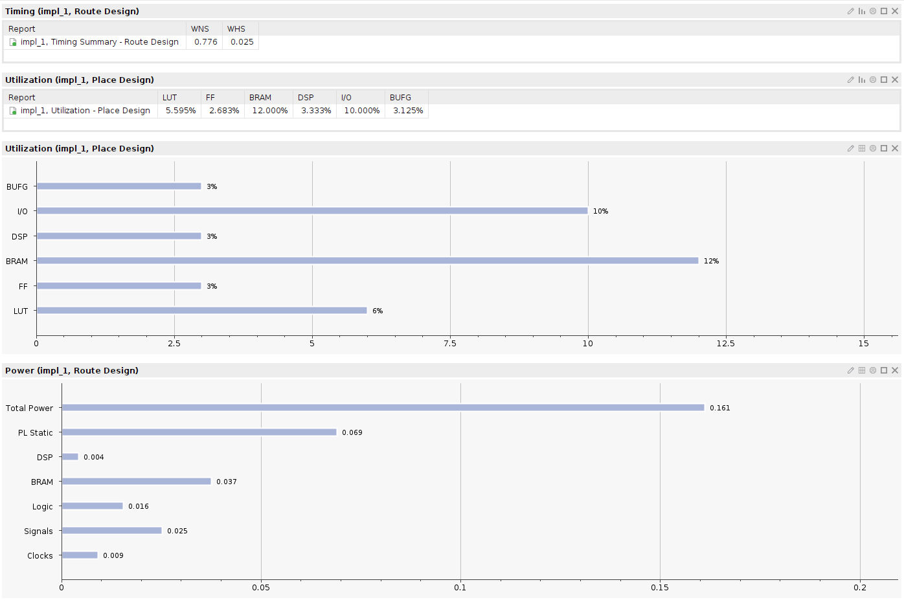

****

# 🚎 Arty-S7-Rover (base architecture)

### Disclaimer

> ==**Build a project** with the Arty S7==, [7 Ways to Leave Your Spartan-6 FPGA](https://community.element14.com/technologies/fpga-group/w/documents/27537/7-ways-to-leave-your-spartan-6-fpga) [](https://community.element14.com/) challenge.

The Arty-S7-Rover is a small functional autonomous vehicle based on the [Digilent Arty S7-50 board](https://digilent.com/reference/programmable-logic/arty-s7/start). The project was done for the [7 Ways to Leave Your Spartan-6 FPGA](https://community.element14.com/technologies/fpga-group/w/documents/27537/7-ways-to-leave-your-spartan-6-fpga) [](https://community.element14.com/) challenge.

All the files are open-source, MIT license and can be downloaded from [-dramoz](https://github.com/dramoz/arty-s7)

### Base Architecture

This first blog of three goes through the initial requirements (e.g. tools, build process) of the Arty-S7-Rover project.

The base architecture implements the RISC-V core, the required memory banks, a UART IP for serial port communications, PWM IP blocks, and a simple firmware to test the setup by controlling the LEDs with user input from the buttons and dipswitch.

## Description

The Arty-S7-Rover is a self-autonomous vehicle that uses a [Xilinx Spartan-7 FPGA](https://www.xilinx.com/products/silicon-devices/fpga/spartan-7.html) as its main processor. Inside the FPGA a [RISC-V](https://en.wikipedia.org/wiki/RISC-V) microprocessor was instantiated plus other IP blocks to control the vehicle. Without too many details, the Arty-S7-Rover consists of three different main blocks:

- Hardware
  - Arty S7-50 development board
    - RISC-V 32bits processor core + instruction/data memory
    - IPs for IO control
  - 3D printed chassis
  - Sensors & Actuators
    - 2xDC motors
    - Ultrasound range finder
    - 10 DOF sensor
- HDL
  - Verilog/SystemVerilog RTL
  - VexRiscv/SpinalHDL RISC-V microprocessor
- Firmware
  - RISC-V C/C++ code

The RISC-V microprocessor was selected as a challenge. Commonly, projects that required an embedded processor in the case of the Spartan-7 use the Xilinx [MicroBlaze Soft Processor Core](https://www.xilinx.com/products/design-tools/microblaze.html), so I was curious about using a different R&D flow for this project.

## Tools (+Setup)

All the development of the project was done in a [VirtualBox](https://www.virtualbox.org/) VM running [ Ubuntu 20.04.4 LTS (Focal Fossa)](https://releases.ubuntu.com/20.04.4/),  on a  host computer with  Windows11/Pro.

> 📝 It should be possible to run the tools natively on a Ubuntu20.04 installation or on WSL2. A Linux distribution is required for RISC-V

### Xilinx - Vivado

Download and install [Vivado ML Edition 2022.1](https://www.xilinx.com/support/download/index.html/content/xilinx/en/downloadNav/vivado-design-tools/2022-1.html). The free edition is Spartan-7 friendly and does not require any license.

> 📝 the drivers to program the Arty-S7 can be installed directly on the VM and use USB passthrough as shown in the picture below. However, in my particular setup, I installed Xilinx Lab Server on the host machine and connected from the Vivado running in the VM.


### SpinalHDL / VexRISCV (optional)

The [](https://riscv.org/) used in this project ([VexRiscv](https://github.com/SpinalHDL/VexRiscv)) was generated using [SpinalHDL](https://spinalhdl.github.io/SpinalDoc-RTD/master/index.html), a [Scala](https://www.scala-lang.org/)-based HDL library. 

> ⚠ Learning Scala or SpinalHDL is not required to build this project or to build a RISC-V as the VexRiscv GitHub project comes with plenty of examples that should cover most needs.

Creating a VexRiscv is as simple as installing the tool and running the script:

```bash
# Scala
mkdir -p ~/tools; cd ~/tools
curl -fL https://github.com/coursier/launchers/raw/master/cs-x86_64-pc-linux.gz | gzip -d > cs && chmod +x cs && ./cs setup

# VexRiscv Generator
cd ~/repos
git clone git@github.com:SpinalHDL/VexRiscv.git
cd ~/repos/VexRiscv/
sbt "runMain vexriscv.demo.GenFull"
```

👉The generated output is a Verilog (.v) file.

> 📝The VexRiscv used in this project is already generated and saved in the repository.

The [dramoz/arty-s7](https://github.com/dramoz/arty-s7) repository submodules the [dramoz/vexriscv_generator](https://github.com/dramoz/vexriscv_generator) repository, where the required files to generate the core processor and the firmware are located.

### RISC-V Toolchain (C/C++)

To compile the FW, download and install the prebuilt [](https://www.sifive.com/) [toolchain](https://www.sifive.com/software):

```bash
# Download toolchain
mkdir -p ~/tools; cd ~/tools
wget https://static.dev.sifive.com/dev-tools/freedom-tools/v2020.12/riscv64-unknown-elf-toolchain-10.2.0-2020.12.8-x86_64-linux-ubuntu14.tar.gz

# Extract and move to installation directory
tar -xzvf riscv64-unknown-elf-toolchain-10.2.0-2020.12.8-x86_64-linux-ubuntu14.tar.gz
sudo mv riscv64-unknown-elf-toolchain-10.2.0-2020.12.8-x86_64-linux-ubuntu14 /opt/riscv64-unknown-elf-toolchain

# Update bash to add toolchain path
echo 'export PATH=/opt/riscv64-unknown-elf-toolchain/bin:$PATH' >> ~/.bashrc
source ~/.bashrc

# Test
riscv64-unknown-elf-gcc --version
> riscv64-unknown-elf-gcc (SiFive GCC-Metal 10.2.0-2020.12.8) 10.2.0
> Copyright (C) 2020 Free Software Foundation, Inc.
> This is free software; see the source for copying conditions.  There is NO
> warranty; not even for MERCHANTABILITY or FITNESS FOR A PARTICULAR PURPOSE.
```

### Other tools

Other tools used in this project

- [ Visual Studio Code](https://code.visualstudio.com/)
  - [ TerosHDL](https://marketplace.visualstudio.com/items?itemName=teros-technology.teroshdl) plugin (for documentation generation)
-  [ VirtualBox](https://www.virtualbox.org/)

## Creating the project

### VexRiscv

The VexRiscv is a plugin-based HDL RISC-V core. For this project, a simple architecture was selected:

- RV32IM
  - 32-bit architecture
  - Integer ALU plus multiplication and division
  - 5-stage in-order pipeline
- Simple instruction/data memory access (e.g. no cached)

> 👉The custom Scala code is just to split the generated Verilog RTL in a wrapper and an implemented design, as I prefer to have a top wrapper to hide the one-file has it all VexRiscv style.

#### Block Diagram

The generated RIRSC-V core has the following IO ports:

<p align = "center">
  
</p>
<p align = "center">
<i>Arty-S7 VexRiscv core block diagram</i>
</p>

### Core RAM

As the generated processor core does not have any memory instantiation, the instruction/data memory is created as a true dual-port RAM using Vivado. The RAM is implemented with the following parameters, as required by the VexRiscv architecture:

- True dual port, read first w/ Byte-write
- 8192 Bytes
  - 4096 instruction memory
  - 4096 data memory
- Low latency (e.g. not registered outputs): VexRiscv requires that memory access has only one clock latency.

Selecting the template:

- ` Project Manager ˃ Language Templates  `
  -  `Verilog ˃ Synthesis Constructs ˃ Coding Examples ˃ RAM ˃ BlockRAM ˃ True Dual Port`
    - `True Dual Port ˃ 1 Clock  ˃ Write First Mode w/ Byte-write` 

<p align = "center">
  
</p>
<p align = "center">
<i>Vivado Language Templates</i>
</p>

> ⚠ Instruction and data memory share the same memory block, where instruction access is read-only while data access is read/write (which would be useful if JTAG debug is implemented)

### IO Peripherals

#### IO Registers bank

### Resource utilization

<details>
  <summary>Vivado Utilization Report</summary>
  <pre>
Copyright 1986-2022 Xilinx, Inc. All Rights Reserved.
--------------------------------------------------------------------------------------------------------------------------------------------
| Tool Version : Vivado v.2022.1 (lin64) Build 3526262 Mon Apr 18 15:47:01 MDT 2022
| Date         : Wed Jul 20 18:53:10 2022
| Host         : ubuntu20-vm running 64-bit Ubuntu 20.04.4 LTS
| Command      : report_utilization -file /home/dramoz/dev/arty-s7/projects/arty_s7_atrover/assets/impl_utilization.txt -name utilization_2
| Design       : arty_s7_atrover
| Device       : xc7s50csga324-1
| Speed File   : -1
| Design State : Routed
--------------------------------------------------------------------------------------------------------------------------------------------

Utilization Design Information

Table of Contents
-----------------
1. Slice Logic
1.1 Summary of Registers by Type
2. Slice Logic Distribution
3. Memory
4. DSP
5. IO and GT Specific
6. Clocking
7. Specific Feature
8. Primitives
9. Black Boxes
10. Instantiated Netlists

1. Slice Logic
--------------

+-------------------------+------+-------+------------+-----------+-------+
|        Site Type        | Used | Fixed | Prohibited | Available | Util% |
+-------------------------+------+-------+------------+-----------+-------+
| Slice LUTs              | 1824 |     0 |          0 |     32600 |  5.60 |
|   LUT as Logic          | 1824 |     0 |          0 |     32600 |  5.60 |
|   LUT as Memory         |    0 |     0 |          0 |      9600 |  0.00 |
| Slice Registers         | 1749 |     0 |          0 |     65200 |  2.68 |
|   Register as Flip Flop | 1749 |     0 |          0 |     65200 |  2.68 |
|   Register as Latch     |    0 |     0 |          0 |     65200 |  0.00 |
| F7 Muxes                |   64 |     0 |          0 |     16300 |  0.39 |
| F8 Muxes                |   32 |     0 |          0 |      8150 |  0.39 |
+-------------------------+------+-------+------------+-----------+-------+


1.1 Summary of Registers by Type
--------------------------------

+-------+--------------+-------------+--------------+
| Total | Clock Enable | Synchronous | Asynchronous |
+-------+--------------+-------------+--------------+
| 0     |            _ |           - |            - |
| 0     |            _ |           - |          Set |
| 0     |            _ |           - |        Reset |
| 0     |            _ |         Set |            - |
| 0     |            _ |       Reset |            - |
| 0     |          Yes |           - |            - |
| 3     |          Yes |           - |          Set |
| 164   |          Yes |           - |        Reset |
| 0     |          Yes |         Set |            - |
| 1582  |          Yes |       Reset |            - |
+-------+--------------+-------------+--------------+


2. Slice Logic Distribution
---------------------------

+--------------------------------------------+------+-------+------------+-----------+-------+
|                  Site Type                 | Used | Fixed | Prohibited | Available | Util% |
+--------------------------------------------+------+-------+------------+-----------+-------+
| Slice                                      |  742 |     0 |          0 |      8150 |  9.10 |
|   SLICEL                                   |  481 |     0 |            |           |       |
|   SLICEM                                   |  261 |     0 |            |           |       |
| LUT as Logic                               | 1824 |     0 |          0 |     32600 |  5.60 |
|   using O5 output only                     |    1 |       |            |           |       |
|   using O6 output only                     | 1554 |       |            |           |       |
|   using O5 and O6                          |  269 |       |            |           |       |
| LUT as Memory                              |    0 |     0 |          0 |      9600 |  0.00 |
|   LUT as Distributed RAM                   |    0 |     0 |            |           |       |
|   LUT as Shift Register                    |    0 |     0 |            |           |       |
| Slice Registers                            | 1749 |     0 |          0 |     65200 |  2.68 |
|   Register driven from within the Slice    |  797 |       |            |           |       |
|   Register driven from outside the Slice   |  952 |       |            |           |       |
|     LUT in front of the register is unused |  479 |       |            |           |       |
|     LUT in front of the register is used   |  473 |       |            |           |       |
| Unique Control Sets                        |   43 |       |          0 |      8150 |  0.53 |
+--------------------------------------------+------+-------+------------+-----------+-------+
* * Note: Available Control Sets calculated as Slice * 1, Review the Control Sets Report for more information regarding control sets.


3. Memory
---------

+-------------------+------+-------+------------+-----------+-------+
|     Site Type     | Used | Fixed | Prohibited | Available | Util% |
+-------------------+------+-------+------------+-----------+-------+
| Block RAM Tile    |    9 |     0 |          0 |        75 | 12.00 |
|   RAMB36/FIFO*    |    8 |     0 |          0 |        75 | 10.67 |
|     RAMB36E1 only |    8 |       |            |           |       |
|   RAMB18          |    2 |     0 |          0 |       150 |  1.33 |
|     RAMB18E1 only |    2 |       |            |           |       |
+-------------------+------+-------+------------+-----------+-------+
* Note: Each Block RAM Tile only has one FIFO logic available and therefore can accommodate only one FIFO36E1 or one FIFO18E1. However, if a FIFO18E1 occupies a Block RAM Tile, that tile can still accommodate a RAMB18E1


4. DSP
------

+----------------+------+-------+------------+-----------+-------+
|    Site Type   | Used | Fixed | Prohibited | Available | Util% |
+----------------+------+-------+------------+-----------+-------+
| DSPs           |    4 |     0 |          0 |       120 |  3.33 |
|   DSP48E1 only |    4 |       |            |           |       |
+----------------+------+-------+------------+-----------+-------+


5. IO and GT Specific
---------------------

+-----------------------------+------+-------+------------+-----------+-------+
|          Site Type          | Used | Fixed | Prohibited | Available | Util% |
+-----------------------------+------+-------+------------+-----------+-------+
| Bonded IOB                  |   21 |    21 |          0 |       210 | 10.00 |
|   IOB Master Pads           |    8 |       |            |           |       |
|   IOB Slave Pads            |   12 |       |            |           |       |
| Bonded IPADs                |    0 |     0 |          0 |         2 |  0.00 |
| PHY_CONTROL                 |    0 |     0 |          0 |         5 |  0.00 |
| PHASER_REF                  |    0 |     0 |          0 |         5 |  0.00 |
| OUT_FIFO                    |    0 |     0 |          0 |        20 |  0.00 |
| IN_FIFO                     |    0 |     0 |          0 |        20 |  0.00 |
| IDELAYCTRL                  |    0 |     0 |          0 |         5 |  0.00 |
| IBUFDS                      |    0 |     0 |          0 |       202 |  0.00 |
| PHASER_OUT/PHASER_OUT_PHY   |    0 |     0 |          0 |        20 |  0.00 |
| PHASER_IN/PHASER_IN_PHY     |    0 |     0 |          0 |        20 |  0.00 |
| IDELAYE2/IDELAYE2_FINEDELAY |    0 |     0 |          0 |       250 |  0.00 |
| ILOGIC                      |    0 |     0 |          0 |       210 |  0.00 |
| OLOGIC                      |    0 |     0 |          0 |       210 |  0.00 |
+-----------------------------+------+-------+------------+-----------+-------+


6. Clocking
-----------

+------------+------+-------+------------+-----------+-------+
|  Site Type | Used | Fixed | Prohibited | Available | Util% |
+------------+------+-------+------------+-----------+-------+
| BUFGCTRL   |    1 |     0 |          0 |        32 |  3.13 |
| BUFIO      |    0 |     0 |          0 |        20 |  0.00 |
| MMCME2_ADV |    0 |     0 |          0 |         5 |  0.00 |
| PLLE2_ADV  |    0 |     0 |          0 |         5 |  0.00 |
| BUFMRCE    |    0 |     0 |          0 |        10 |  0.00 |
| BUFHCE     |    0 |     0 |          0 |        72 |  0.00 |
| BUFR       |    0 |     0 |          0 |        20 |  0.00 |
+------------+------+-------+------------+-----------+-------+


7. Specific Feature
-------------------

+-------------+------+-------+------------+-----------+-------+
|  Site Type  | Used | Fixed | Prohibited | Available | Util% |
+-------------+------+-------+------------+-----------+-------+
| BSCANE2     |    0 |     0 |          0 |         4 |  0.00 |
| CAPTUREE2   |    0 |     0 |          0 |         1 |  0.00 |
| DNA_PORT    |    0 |     0 |          0 |         1 |  0.00 |
| EFUSE_USR   |    0 |     0 |          0 |         1 |  0.00 |
| FRAME_ECCE2 |    0 |     0 |          0 |         1 |  0.00 |
| ICAPE2      |    0 |     0 |          0 |         2 |  0.00 |
| STARTUPE2   |    0 |     0 |          0 |         1 |  0.00 |
| XADC        |    0 |     0 |          0 |         1 |  0.00 |
+-------------+------+-------+------------+-----------+-------+


8. Primitives
-------------

+----------+------+---------------------+
| Ref Name | Used | Functional Category |
+----------+------+---------------------+
| FDRE     | 1582 |        Flop & Latch |
| LUT6     |  936 |                 LUT |
| LUT5     |  390 |                 LUT |
| LUT3     |  267 |                 LUT |
| LUT4     |  260 |                 LUT |
| LUT2     |  227 |                 LUT |
| FDCE     |  164 |        Flop & Latch |
| CARRY4   |  149 |          CarryLogic |
| MUXF7    |   64 |               MuxFx |
| MUXF8    |   32 |               MuxFx |
| LUT1     |   13 |                 LUT |
| OBUF     |   11 |                  IO |
| IBUF     |   10 |                  IO |
| RAMB36E1 |    8 |        Block Memory |
| DSP48E1  |    4 |    Block Arithmetic |
| FDPE     |    3 |        Flop & Latch |
| RAMB18E1 |    2 |        Block Memory |
| BUFG     |    1 |               Clock |
+----------+------+---------------------+

  </pre>
</details>

<p align = "center">
  
</p>
<p align = "center">
<i>Base Architecture Implementation Report (Vivado)</i>
</p>

## Future work

## References

