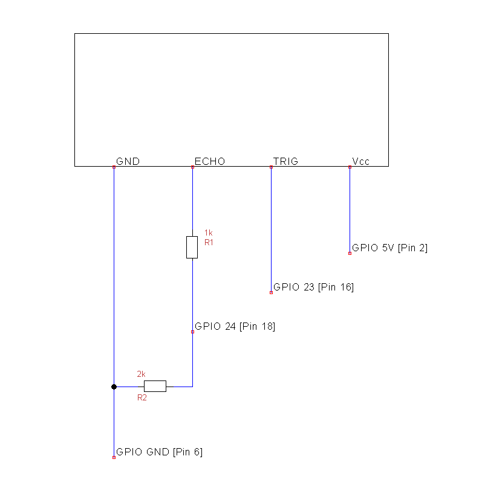
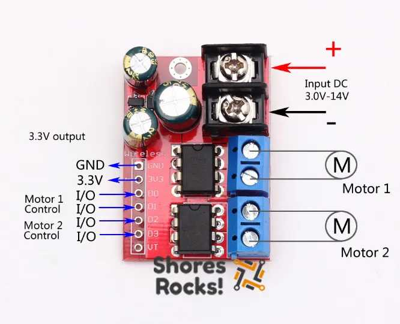
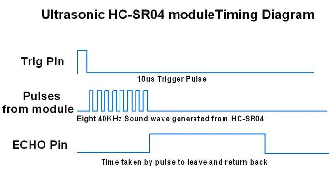
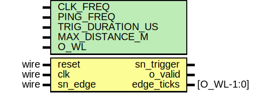

****

# 🚎 Arty-S7-Rover (sensor+actuator)

### Disclaimer

> ==**Add a sensor to your project** with the Arty S7==, [7 Ways to Leave Your Spartan-6 FPGA](https://community.element14.com/technologies/fpga-group/w/documents/27537/7-ways-to-leave-your-spartan-6-fpga) [](https://community.element14.com/) challenge.

The Arty-S7-Rover is a small functional autonomous vehicle based on the [Digilent Arty S7-50 board](https://digilent.com/reference/programmable-logic/arty-s7/start). The project was done for the [7 Ways to Leave Your Spartan-6 FPGA](https://community.element14.com/technologies/fpga-group/w/documents/27537/7-ways-to-leave-your-spartan-6-fpga) [](https://community.element14.com/) challenge.

All the files are open-source, MIT license and can be downloaded from [-dramoz](https://github.com/dramoz/arty-s7)

### Sensor + Actuator

In this second part, a range ultrasound sensor and a 2xDC motor driver would be implemented.

If you have note read it yet, please check the first blog [🚎 Arty-S7-Rover (base architecture)](spartan7_blog_project.md) as this section rely on that.

## The Hardware

###  Ultrasonic HC-SR04 distance sensor

|                            &nbsp;                            | &nbsp;                                                       |
| :----------------------------------------------------------: | :----------------------------------------------------------- |
| <br /> | **Features**<br />- Ranging distance: 2cm to 4m<br />- Ranging accuracy: 3mm<br />- Operating Voltage: 5V<br />- Current: 15 mA<br />- Frequency: 40 Hz<br />- Measuring angle: 30 degrees<br />- Effectual angle: 15 degrees<br /> |

The HC-SR04 is a commonly used ultrasonic distance sensor. An inexpensive device with high enough accuracy for robot projects with plenty of tutorials and examples on the web. Most of the implementations around use a microcontroller which requires several calculations with idle time while waiting on the sensor response.

One caveat is that the sensor works with 5Vdc, and although it can work at 3.3Vdc, its performance is highly diminished. Fortunately, the input trigger works fine with a 3.3Vdc input signal, and for the output, a simple resistance divisor suffices.

<p align = "center">
  
</p>
<p align = "center">
<i>Ultrasonic Sensor Voltage Divisor</i>
</p>

####  References

- [Ultrasonic Sensor HC-SR04 with Arduino Tutorial](https://create.arduino.cc/projecthub/abdularbi17/ultrasonic-sensor-hc-sr04-with-arduino-tutorial-327ff6)
- [HC-SR04 Ultrasonic Range Sensor on the Raspberry Pi](https://thepihut.com/blogs/raspberry-pi-tutorials/hc-sr04-ultrasonic-range-sensor-on-the-raspberry-pi)

### DC Motor Driver

The Arty-S7-ROVER has two 12V/40W DC motors. The [ZK-5AD](https://www.aliexpress.com/item/1005002100401855.html) with two [TA6586](https://www.micros.com.pl/mediaserver/UITA6586_0001.pdf) monolithic IC can drive both motors with a full H-bridge for bi-directional control.

- Working Voltage: DC 3.0V-14V
- Input Signal Voltage: DC 2.2V-6.0V
- Drive Current: 5A
- Standby Current: 10uA
- Working Temperature:-20 to 85 Celsius

As with any H-Bridge, it can be controlled with two PMW per motor to move forward or backward.

| DC Motor 1 |  D0  |  D1  |  D2  |  D3  |
| ---------- | :--: | :--: | :--: | :--: |
| Forward    | PMW  |  0   |      |      |
| Reverse    |  0   | PWM  |      |      |
| Stop       |  0   |  0   |      |      |
| Break      |  1   |  1   |      |      |

| DC Motor 2 |  D0  |  D1  |  D2  |  D3  |
| ---------- | :--: | :--: | :--: | :--: |
| Forward    |      |      | PWM  |  0   |
| Reverse    |      |      |  0   | PWM  |
| Stop       |      |      |  0   |  0   |
| Break      |      |      |  1   |  1   |

<p align = "center">
  
  
</p>
<p align = "center">
<i>ZK-5AD DC Motor Driver</i>
</p>

#### DC Motors

For the Arty-S7-ROVER I am using two [CHIHAI GM37-550 DC motor ](https://www.aliexpress.com/item/4000808942638.html?pdp_ext_f={"sku_id":"10000008104483462","ship_from":""}&gps-id=pcStoreJustForYou&scm=1007.23125.137358.0&scm_id=1007.23125.137358.0&scm-url=1007.23125.137358.0&pvid=49f50fc1-c29b-4a45-91ae-5cb7468be7b7&spm=a2g0o.store_pc_home.smartJustForYou_718209649.0)with a gear ratio of 50:1 and 12Vdc with a maximum input power of 40W.

> ⚠These motors are kind of powerful. I am using them as that is the chassis and hardware I already have from a previous project.

<p align = "center">
  
</p>
<p align = "center">
<i>CHIHAI GM37-550 DC motor</i>
</p>
## RTL

### DC Motors PWM

The DC motors are controlled by four independent PWM blocks. All have the same PWM frequency of 500 Hz[^1].

[^1]: Finding the right PWM frequency and duty cycle was an interesting experiment, for more details check my post [🚎 Arty-S7-Rover (experiments)](spartan7_blog_experiments.md)

```c++
// Final DC motors PWM setup
const uint32_t MOTOR_PWM_FREQ   = 500;
const uint32_t MOTOR_FULL_STOP  = 0;
const uint32_t MOTOR_SLOW_SPEED = uint32_t(0.3 * CLK_FREQ/MOTOR_PWM_FREQ);
const uint32_t MOTOR_MEDIUM_SPEED = uint32_t(0.5 * CLK_FREQ/MOTOR_PWM_FREQ);
const uint32_t MOTOR_HIGH_SPEED = uint32_t(0.8 * CLK_FREQ/MOTOR_PWM_FREQ);
```

The DC motors required special care, as only one PWM per motor should be working at the time. The control of the motors was done primarily with FW. As the motors present different behaviours while moving backward or forward, and even between motors - having four independent PWM channels (2 per motor) was ideal as this enabled the possibility of fine-tuning each motor movement. In this project, this was done on a trial and error basis, but it is planned to automate this by adding extra sensors on each wheel.

The firmware is aware of the current direction and speed, and on a direction/speed change request it performs the required steps as slowing and stopping first before changing direction.

> ⚠ At the time of posting this blog, the DC Motor PWM C++ Control Class is still under development and requires more formal testing - please use it with caution.

```c++
// --------------------------------------------------------------------------------
// Dual DC Motor Control (ZK-5AD / IC:TA6586)
//
// M1: [ D0 | D1 ]
//        0    0  : Stop
//      PMW    0  : FWD
//        0  PMW  : BWD
//        1    1  : Brake
//
// M2: [D2 | D3] -> same as M1
// --------------------------------------------------------------------------------
#pragma once
// --------------------------------------------------------------------------------
#include <math.h>
// --------------------------------------------------------------------------------
inline int calc_duty_cycle(int vl) {
    return ( (vl*1000)/256 )/10;
}
// --------------------------------------------------------------------------------
enum class eDualMotorDirection {
    BACKWARDS = 0,
    FORWARDS  = 1,
    LEFT =  2,
    RIGHT = 3,
    STOP = 4
};
extern const char* eDualMotorDirection_Names[];

enum class eDualMotorFSM { IDLE, STOPPING, ACCEL, DEACCEL };
// --------------------------------------------------------------------------------
class clDualDC_MotorCtrl {
public:
  int min_speed;
  int max_speed;
  int speed_step;     // Speed MUST be int div of MAX_SPEED and MIN_SPEED
  int accel_step_ms;  // time to wait between speed changes in ms
  
  clDualDC_MotorCtrl(int PWMFreq=5000, int PWMResolution=8, int min_speed=32, int max_speed=0, int speed_step=8, int accel_step_ms=1)
  : min_speed(min_speed)
  , max_speed(max_speed)
  , speed_step(speed_step)
  , accel_step_ms(accel_step_ms)
  
  , _PWMFreq(PWMFreq)
  , _PWMResolution(PWMResolution)
  , _speed(0)
  , _direction(eDualMotorDirection::STOP)
  , _last_update(0)
  , _status(eDualMotorFSM::IDLE)
  , _target_speed(0)
  , _target_direction(eDualMotorDirection::STOP)
  //, _set_func({&set_bwd, &set_fwd, &set_lft, &set_rgt})
  {
      if(max_speed) {
        this->max_speed = (int)(pow(2, PWMResolution));
      }
      while( (max_speed-min_speed)%speed_step != 0) {
          --speed_step;
      }
      
      _set_func[static_cast<size_t>(eDualMotorDirection::BACKWARDS)] = &clDualDC_MotorCtrl::set_bwd;
      _set_func[static_cast<size_t>(eDualMotorDirection::FORWARDS)]  = &clDualDC_MotorCtrl::set_fwd;
      _set_func[static_cast<size_t>(eDualMotorDirection::LEFT)]      = &clDualDC_MotorCtrl::set_lft;
      _set_func[static_cast<size_t>(eDualMotorDirection::RIGHT)]     = &clDualDC_MotorCtrl::set_rgt;
  }
  
  void init(void);
  void loop(void);
  
  //void halt_break(void);
  void move(int speed, eDualMotorDirection direction) { step_start(speed, direction); }
  void stop(void)               { step_start(0, eDualMotorDirection::STOP); }
  void move_forward(int speed)  { step_start(speed, eDualMotorDirection::FORWARDS); }
  void move_backward(int speed) { step_start(speed, eDualMotorDirection::BACKWARDS); }
  void turn_left(int speed)     { step_start(speed, eDualMotorDirection::LEFT); }
  void turn_right(int speed)    { step_start(speed, eDualMotorDirection::RIGHT); }
  
  void emergency_stop(void) { _speed = 0; _direction = eDualMotorDirection::STOP; set_fwd(); }
  
private:
  int _PWMFreq = 5000; /* 5 KHz */
  int _PWMResolution = 8;
  
  int _speed;
  eDualMotorDirection _direction;
  
  long _last_update;
  eDualMotorFSM _status;
  int _target_speed;
  eDualMotorDirection _target_direction;
  
  void step_start(int target_speed, eDualMotorDirection target_direction);
  void step(void);
  
  void set_fwd(void) {
    wRITE_IO(M0_FWD_PWM_REG, _speed);
    wRITE_IO(M1_FWD_PWM_REG, _speed);
  }
  void set_bwd(void) {
    wRITE_IO(M0_BWD_PWM_REG, _speed);
    wRITE_IO(M1_BWD_PWM_REG, _speed);
  }
  void set_lft(void) {
    wRITE_IO(M0_BWD_PWM_REG, _speed);
    wRITE_IO(M1_FWD_PWM_REG, _speed);
  }
  void set_rgt(void) {
    wRITE_IO(M0_FWD_PWM_REG, _speed);
    wRITE_IO(M1_BWD_PWM_REG, _speed);
  }
  typedef void (clDualDC_MotorCtrl::*fptr_set_func)(void);
  fptr_set_func _set_func[4];
};
// --------------------------------------------------------------------------------
extern clDualDC_MotorCtrl DualDC_MotorCtrl;
```

```c++
// --------------------------------------------------------------------------------
#include "dc_motors_pwm.h"
// TODO: add all func to array of functions
// --------------------------------------------------------------------------------
const char* eDualMotorDirection_Names[] = {
    "BACKWARDS",
    "FORWARDS",
    "LEFT",
    "RIGHT",
    "STOP"
};
// --------------------------------------------------------------------------------
void clDualDC_MotorCtrl::init(void)
{
    for(auto inx=0; inx<4; ++inx) {
        wRITE_IO(pwm_channels[inx], 0);
    }
}

// --------------------------------------------------------------------------------
void clDualDC_MotorCtrl::loop(void) {
  if(curr_millis - _last_update > accel_step_ms) {
    _last_update = curr_millis;
    if(_status!=eDualMotorFSM::IDLE) {
      step();
    }
  }
}

// --------------------------------------------------------------------------------
void clDualDC_MotorCtrl::step_start(int target_speed, eDualMotorDirection target_direction) {
    if(target_speed < min_speed) {
      target_speed = 0;
      target_direction = eDualMotorDirection::STOP;
    } else {
      if(target_speed > max_speed) {
        target_speed = max_speed;
      }
    }
    
    _target_speed = target_speed;
    _target_direction = target_direction;
    if(_target_direction != _direction) {
      _status = eDualMotorFSM::STOPPING;
    } else {
      if(_target_speed != _speed) {
        _status = (_target_speed > _speed) ? (eDualMotorFSM::ACCEL) : (eDualMotorFSM::DEACCEL);
      }
    }
    step();
}

// --------------------------------------------------------------------------------
void clDualDC_MotorCtrl::step(void) {
  switch(_status)
  {
    case eDualMotorFSM::IDLE: {
      break;
    }
    case eDualMotorFSM::STOPPING: {
      _speed -= speed_step;
      if(_speed < min_speed) {
        _speed = 0;
      }
      (this->*_set_func[static_cast<size_t>(_direction)])();
      
      if(_speed == 0) {
        _direction = _target_direction;
        
        if(_target_speed != 0) {
          _status = eDualMotorFSM::ACCEL;
        } else {
          _status = eDualMotorFSM::IDLE;
        }
      }
      break;
    }
    case eDualMotorFSM::ACCEL: {
      if(_speed < _target_speed) {
        _speed += speed_step;
      }
      (this->*_set_func[static_cast<size_t>(_direction)])();
      
      if(_speed == _target_speed) {
        _status = eDualMotorFSM::IDLE;
      }
      break;
    }
    case eDualMotorFSM::DEACCEL: {
      if(_speed > _target_speed) {
        _speed -= speed_step;
      }
      (this->*_set_func[static_cast<size_t>(_direction)])();
      
      if(_speed == _target_speed) {
        _status = eDualMotorFSM::IDLE;
      }
      break;
    }
  }
}
// --------------------------------------------------------------------------------
```

### Sensing Distance with sound waves

The HC-SR04 works as follows:

- An input of 10us pulse on the input trigger pin starts the process
- The sensor sends 8x 40KHz pulses over the air
- The echo pin generates a pulse whose duration is equivalent to the time of flight of the signal forward and backward 

<p align = "center">
  
</p>
<p align = "center">
<i>Ultrasonic Sensor Timing IO diagram</i>
</p>

The controller is responsible for generating the trigger and measuring the duration of the echo pulse which is used later for estimating the distance. As this is an FPGA project 😎, the HDL block was designed to autonomously generate a continuous ping for distance and continuously update a register. The RISC-V FW poll for the distance as required.

<p align = "center">
  
</p>
<p align = "center">
<i>Ultrasonic Sensor Block IO diagram</i>
</p>

```verilog
module hc_sr04_distance_sensor
#(
  parameter CLK_FREQ         = 100000000,
  parameter PING_FREQ        = 100,
  parameter TRIG_DURATION_US = 10,
  parameter MAX_DISTANCE_M   = 4,
  parameter O_WL             = 32
)
(
  input  wire reset,
  input  wire clk,
  
  output logic sn_trigger,
  input  wire  sn_edge,
  
  output logic            o_valid,
  output logic [O_WL-1:0] edge_ticks
);
  localparam SOUND_SPEED_M_S = 340;
  localparam real MAX_TIME = ((2.0*MAX_DISTANCE_M)/SOUND_SPEED_M_S);
  localparam EDGE_CNT_WL = $clog2(int'(real'(CLK_FREQ)*MAX_TIME));
  
  localparam PING_CNT    = int'(CLK_FREQ/PING_FREQ);
  localparam TRIG_CNT = int'((TRIG_DURATION_US*CLK_FREQ)/1e6);
  localparam PING_CNT_WL = $clog2(PING_CNT+TRIG_CNT+1);
  
  logic [PING_CNT_WL-1:0] ping_trigg_cnt;
  always_ff @( posedge clk ) begin: distance_sensor_trigger_proc
    if(reset) begin
      ping_trigg_cnt <= '0;
      sn_trigger     <= '0;
      
    end else begin
      if(ping_trigg_cnt < (PING_CNT+TRIG_CNT)) begin
        ping_trigg_cnt <= ping_trigg_cnt + 1;
      end else begin
        ping_trigg_cnt <= '0;
      end
      
      sn_trigger <= (ping_trigg_cnt < PING_CNT) ? (0) : (1);
    end
  end: distance_sensor_trigger_proc
  
  
  logic                   edge_d;
  logic [EDGE_CNT_WL-1:0] edge_cnt;
  always_ff @( posedge clk ) begin: distance_sensor_measure_proc
    if(reset) begin
      edge_d      <= 1'b0;
      edge_cnt    <= '0;
      o_valid     <= 1'b0;
      edge_ticks  <= '0;
      
    end else begin
      edge_d <= sn_edge;
      
      if(edge_d && !sn_edge) begin
        edge_cnt <= '0;
        o_valid  <= 1;
        
        edge_ticks           <= '0;
        edge_ticks[O_WL-1:0] <= edge_cnt;
        
      end else begin
        o_valid <= 0;
        if(sn_edge) begin
          if(edge_cnt != '1) begin
            edge_cnt <= edge_cnt + 1;
          end
        end
      end
    end
  end: distance_sensor_measure_proc
  
endmodule: hc_sr04_distance_sensor

```

The distance in `cm` is calculated as $34000t$ (as measured by the HDL, or $N_{cycles}*CLK_{FREQ}$)

> 📝 Converting the measured value from clock-cycles count to `cm` is required for human reading purposes. There is no actual need to convert it and internally, it is possible to work with the cycles count as it is to control the rover.

### Lab Test

A small FW was done to test the distance sensor against the rover's speed. [Arty-S7-Rover Distance Sensor Lab Test Demo-Video](https://youtu.be/LdeiwEiGDuM)

```c++
#include<cstdint>
#include "memory_map.h"

const uint32_t CLK_FREQ = 100000000UL;
const uint32_t MSB_MASK = 0x80000000;

const uint32_t RGB_PWM_FREQ =     20000;
const uint32_t RGB_DCYLE    = uint32_t(0.01 * CLK_FREQ/RGB_PWM_FREQ);

const uint32_t MOTOR_PWM_FREQ   = 500;
const uint32_t MOTOR_FULL_STOP  = 0;
const uint32_t MOTOR_SLOW_SPEED = uint32_t(0.3 * CLK_FREQ/MOTOR_PWM_FREQ);
const uint32_t MOTOR_MEDIUM_SPEED = uint32_t(0.5 * CLK_FREQ/MOTOR_PWM_FREQ);
const uint32_t MOTOR_HIGH_SPEED = uint32_t(0.8 * CLK_FREQ/MOTOR_PWM_FREQ);

// Distance calc.
// n-ticks, 1/clk_freq * N = t
// d = s*t = 34000 cm/s * 1/clk_freq * N
// -> ticks: d = 34000 cm/s * 1/clk_freq * N
//           N = d*clk_freq/34000
#define D2CNT(D) (uint32_t)((2*D*CLK_FREQ)/34000UL)
const uint32_t DISTANCE_STOP   = D2CNT(10);
const uint32_t DISTANCE_SLOW   = D2CNT(50);
const uint32_t DISTANCE_MEDIUM = D2CNT(100);

// -------------------------------------------------------------------
const uint32_t MAX_MSG_LEN = 80;
void reverse_string(char str[], int length)
{
    int start = 0;
    int end = length;
    while (start < end)
    {
        auto swap = *(str+start);
        *(str+start) = *(str+end);
        *(str+end) = swap;
        start++;
        end--;
    }
}

uint32_t uitoa(int num, char* str)
{
    uint32_t i = 0;
 
    if (num == 0)
    {
        str[i++] = '0';
    }
    else {
      // Process individual digits
      while (num != 0)
      {
          int rem = num % 10;
          str[i++] = rem + '0';
          num = num/10;
      }
      
      // Reverse the string
      reverse_string(str, i);
    }
    
    str[i++] = '\r';
    str[i++] = '\n';
    str[i] = '\0';
 
    return i;
}
void send_msg(const char* msg) {
  uint32_t uart_tx;
  
  for(uint32_t inx=0; msg[inx] !=0; ++inx) {
    do {
      uart_tx = READ_IO(UART0_TX_REG);
    } while( (uart_tx & MSB_MASK) != 0);
    
    WRITE_IO(UART0_TX_REG, (uint32_t)msg[inx] | MSB_MASK);
  }
}

// -------------------------------------------------------------------
int main(void) {
  // LEDs
  uint32_t leds_st = 1;
  uint32_t rgb0 = 0x02;
  uint32_t rgb1 = 0x02;
  
  // IOs
  uint32_t btn = 0;
  uint32_t sw  = 0;
  uint32_t frnt_distance_rd;
  
  // Setup Motors PWMs
  uint32_t motor_curr_speed = MOTOR_FULL_STOP;
  WRITE_IO(M0_BWD_PWM_REG, MOTOR_FULL_STOP);
  WRITE_IO(M0_FWD_PWM_REG, MOTOR_FULL_STOP);
  WRITE_IO(M1_BWD_PWM_REG, MOTOR_FULL_STOP);
  WRITE_IO(M1_FWD_PWM_REG, MOTOR_FULL_STOP);
  
  // Setup RGBs to low intensity
  WRITE_IO(RGB0_DCYCLE_REG, RGB_DCYLE);
  WRITE_IO(RGB1_DCYCLE_REG, RGB_DCYLE);
  
  // Turn on LEDs 1 to ACK PWR and RISCV boot OK.
  WRITE_IO(LEDS_REG, leds_st);
  
  // UART Hello World
  bool uart_tx_busy;
  uint32_t uart_rx;
  uint32_t uart_tx;
  
  const char* hello_msg = "Arty-S7 ROVER (VexRiscv)\r\n";
  const char* press_btn = "\r\nPress ANY button to start test\r\n";
  
  send_msg(hello_msg);
  
  // Loop forever
  const uint32_t do_rpt_ticks = 10000;
  uint32_t rpt_cnt;
  uint32_t msg_rpt_inx;
  uint32_t msg_len;
  char msg_rpt[MAX_MSG_LEN];
  
  uart_tx_busy = false;
  uart_rx = 0;
  frnt_distance_rd = 0;
  for(;;) {
    // Wait for user button to start test
    send_msg(press_btn);
    do {
      btn = READ_IO(BUTTONS_REG);
      
      // Simple code to check FW and HW programmed
      sw  = READ_IO(SWITCHES_REG);
      leds_st = sw;
      
    } while(btn==0x00);
    
    // Setup test
    rpt_cnt = 0;
    motor_curr_speed = MOTOR_HIGH_SPEED;
    
    while(motor_curr_speed!=MOTOR_FULL_STOP) {
      frnt_distance_rd = READ_IO(DST_SENSOR_RD_REG);
      if(frnt_distance_rd & MSB_MASK) {
        frnt_distance_rd &= ~MSB_MASK;
        if(frnt_distance_rd <= DISTANCE_STOP) {
          motor_curr_speed = MOTOR_FULL_STOP;
          rgb0 = 0x01;
          rgb1 = 0x01;
        }
        else if (frnt_distance_rd <= DISTANCE_SLOW) {
          motor_curr_speed = MOTOR_SLOW_SPEED;
          rgb0 = 0x02;
          rgb1 = 0x02;
        }
        else if (frnt_distance_rd <= DISTANCE_MEDIUM) {
          motor_curr_speed = MOTOR_MEDIUM_SPEED;
          rgb0 = 0x04;
          rgb1 = 0x04;
        }
        else {
          motor_curr_speed = MOTOR_HIGH_SPEED;
          rgb0 = 0x07;
          rgb1 = 0x07;
        }
      } // if new distance read
      
      // Move FWD
      WRITE_IO(M0_BWD_PWM_REG, MOTOR_FULL_STOP);
      WRITE_IO(M0_FWD_PWM_REG, motor_curr_speed);
      WRITE_IO(M1_BWD_PWM_REG, MOTOR_FULL_STOP);
      WRITE_IO(M1_FWD_PWM_REG, motor_curr_speed);
      
      // Update LEDs
      WRITE_IO(LEDS_REG, leds_st);
      WRITE_IO(RGB0_REG, rgb0);
      WRITE_IO(RGB1_REG, rgb1);
      
      // UART
      uart_tx = READ_IO(UART0_TX_REG);
      uart_tx_busy = ((uart_tx & MSB_MASK)!=0);
      if(!uart_tx_busy) {
        uart_rx = READ_IO(UART0_RX_REG);
        if(uart_rx & MSB_MASK) {
          WRITE_IO(UART0_TX_REG, uart_rx);
        }
        else {
          ++rpt_cnt;
          if(rpt_cnt == do_rpt_ticks) {
            // Create messge
            msg_rpt_inx = 0;
            /*msg_rpt[msg_rpt_inx++] = 'd';
            msg_rpt[msg_rpt_inx++] = ':';
            msg_rpt[msg_rpt_inx++] = ' ';
            msg_rpt_inx = uitoa(frnt_distance_rd, &msg_rpt[msg_rpt_inx]);
            msg_rpt[msg_rpt_inx++] = '\r';
            msg_rpt[msg_rpt_inx++] = '\n';
            msg_rpt[msg_rpt_inx] = '\0';*/
            msg_rpt_inx = uitoa(frnt_distance_rd, &msg_rpt[msg_rpt_inx]);
            msg_rpt_inx = 0;
          }
          else if(rpt_cnt >= do_rpt_ticks) {
            if(msg_rpt[msg_rpt_inx] != 0) {
              WRITE_IO(UART0_TX_REG, (uint32_t)(msg_rpt[msg_rpt_inx]) | MSB_MASK);
              ++msg_rpt_inx;
            }
            else {
              rpt_cnt = 0;
            }
          }
        } // check do rpt
      } // if !uart_tx_busy
    } // end while moving
  } // forever
  
  return 0;
}
```

### Averaging the measured distance

As seen in the video, by using the instantaneous measurement, the rover can instantly request changes to the speed - as some measurements can be erroneous. To mitigate this effect, an average value was used instead. Two options are possible for this:

- FW implementation
- RTL implementation

Given the abundant resources in the Spartan-7, it made more sense to have done the average in the FPGA as an extra IP block. By doing so, less computing power was required from the RISC-V softcore, which can become an issue in the future as the project evolve.

The implementation is called a [Moving Average Filter](https://zipcpu.com/dsp/2017/10/16/boxcar.html).

<p align = "center">
  
</p>
<p align = "center">
<i>Moving Average Filter Block IO diagram</i>
</p>

## Final Remarks

The versatility of the Spartan 7 was amazing:

- Able to generate as many PWM blocks as required
- Total independent IP block for sensor control
  - Free processor time
  - Highly configurable
- Easy to add extra blocks like Digital filters as required like a [Moving Average FIR](https://en.wikipedia.org/wiki/Finite_impulse_response).
